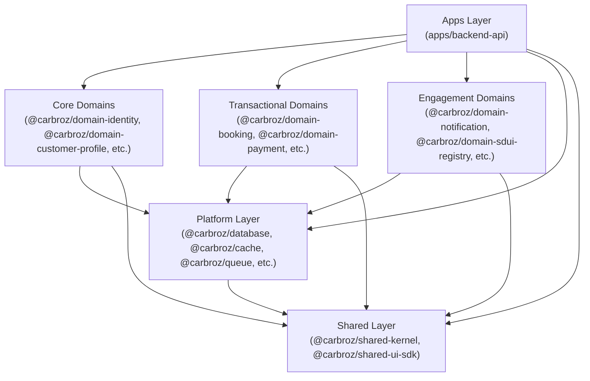

# Workspace Dependency Graph & Directionality Specification

Visual representation and architectural rules governing dependencies.

## 1. Architectural Pillar Graph

---

## 2. Dependency Direction Rules

- Allowed: `Apps` -> `Domains`, `Platform`, `Shared`
- Allowed: `Domains` -> `Platform`, `Shared`
- Allowed: `Platform` -> `Shared`
- Forbidden: `Shared` -> `Platform`, `Domains`, `Apps`
- Forbidden: `Platform` -> `Domains`, `Apps`
- Forbidden: `Domains` -> `Apps`
