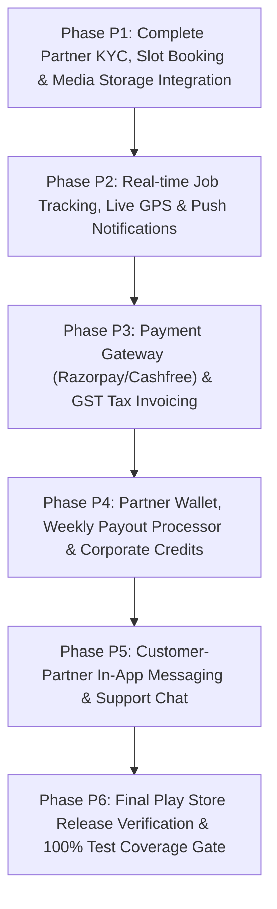

# Product Completion Master Plan & Matrix

Complete production release plan for the CarBroz Backend (Customer App, Partner App, Admin Portal, SDUI Layout Engine, and Infrastructure Integration).

---

## 1. Technology Decision Policy & Zero-Code Provider Swap Strategy

All third-party integrations (Storage, SMS, Email, Maps, Payments, Push Notifications) MUST implement standard interfaces under `platform/providers/`. 

Switching third-party providers (e.g. Supabase Storage → AWS S3 / Cloudflare R2, Razorpay → Cashfree, FCM → OneSignal) requires ONLY:
1. Environment Variable updates (`.env`)
2. Awilix DI Container registration update (`container/index.ts`)

Zero business logic modifications are permitted when swapping infrastructure providers.

| Capability | Initial Preferred Provider | Cost | Alternate Swappable Providers | Provider Swap Strategy |
|---|---|---|---|---|
| **Object Storage** | **Supabase Storage** (S3 Protocol) | **FREE Tier** (5 GB) | AWS S3, Cloudflare R2, MinIO, GCS | Swap `S3StorageProvider` configuration in `.env` |
| **Database** | **PostgreSQL** | Open Source | Neon, Supabase Postgres, AWS RDS | Update `DATABASE_URL` in `.env` |
| **Cache & Lock** | **Redis** | Open Source | Redis Cloud, Upstash | Update `REDIS_URL` in `.env` |
| **Task Queue** | **BullMQ** | Open Source | AWS SQS, RabbitMQ | Swappable queue adapter interface |
| **Push Notifications** | **Firebase Cloud Messaging (FCM)** | **FREE** | OneSignal, APNs | Implement `IPushNotificationProvider` |
| **Maps & Geocoding** | **MapmyIndia / OpenStreetMap** | **FREE / Low Cost** | Google Maps, LocationIQ | Implement `IMapsProvider` |
| **SMS Gateway** | **Fast2SMS / Msg91** | Low Cost | Twilio, AWS SNS | Implement `ISmsProvider` |
| **Email Gateway** | **Resend / SendGrid** | **FREE Tier** (3,000/mo) | AWS SES, Postmark | Implement `IEmailProvider` |
| **Payment Gateway** | **Razorpay** | 2% per txn | Cashfree, PhonePe, Stripe | Implement `IPaymentGatewayProvider` |

---

## 2. Comprehensive Product Completion Matrix

Status Legend:
- `COMPLETED`: 100% Domain, API, Repository, DI, and SDUI ready.
- `PARTIAL`: Domain entity extracted, API endpoints or SDUI screens pending completion.
- `MISSING`: Required for Play Store release; pending implementation phase.
- `BLOCKED`: Dependent on preceding business phase.

| Business / Tech Domain | Customer App Scope | Partner App Scope | Admin Portal Scope | SDUI Layout Readiness | Backend API Status | Overall Status |
|---|---|---|---|---|---|---|
| **Authentication** | Mobile OTP, Google Auth, Refresh Token | Partner Phone Auth, Pin Verification | Admin Email/Password, 2FA | `auth_login_screen` (Done) | Auth Controllers & JWT (Done) | **COMPLETED** |
| **Authorization & RBAC** | Customer Scopes | Partner Role Permissions | Admin Permission Matrix | N/A | `rbac.middleware.ts` (Done) | **COMPLETED** |
| **Customer Profile** | Profile Edit, Avatar Upload | View Customer Details | Customer Management Audit | `profile_screen` (Done) | Profile Use Cases (Done) | **COMPLETED** |
| **Address & Geolocation** | Saved Addresses, GPS Pinning | Service Area Coverage | City & Zone Rules | `address_picker_screen` | Address Controllers (Done) | **COMPLETED** |
| **Partner Profile & KYC** | View Partner Info | Profile Edit, KYC Uploads | KYC Approval Workflow | `partner_kyc_screen` | KYC & Partner Use Cases | **PARTIAL** |
| **Garage & Vehicles** | My Cars, Glovebox Document Vault | Vehicle Selection | Vehicle Master DB | `garage_screen` (Done) | Vehicle Use Cases (Done) | **COMPLETED** |
| **Service Catalog** | Browse Categories, Add-ons | View Service Instructions | Catalog Price & Service Mgmt | `catalog_screen` (Done) | Catalog Endpoints (Done) | **COMPLETED** |
| **Pricing & Dynamic Rates** | Instant Cost Estimate | Rate Card Verification | Dynamic Pricing Surcharges | `pricing_breakdown_screen` | Pricing Engine (Done) | **COMPLETED** |
| **Slot Management** | Select Pickup/Drop Slots | Slot Capacity & Buffer Rules | Slot Schedule Rules | `slot_picker_screen` | Slot Booking Engine | **PARTIAL** |
| **Booking Engine** | Create, Reschedule, Cancel | Accept/Reject, Update Status | Booking Overrides & Dispatch | `booking_detail_screen` | Booking Use Cases (Done) | **COMPLETED** |
| **Real-time Tracking** | Live Status Timeline, GPS | Update Job Stage, Upload Photos | Live Job Monitor Map | `tracking_screen` (Done) | Tracking Session Engine | **PARTIAL** |
| **Notifications** | Push, In-App Center, SMS | Job Alerts, Earnings Push | Broadcast Notifications | `notification_center` | Notification Engine | **PARTIAL** |
| **Coupons & Offers** | Apply Coupon, Savings | N/A | Create & Audit Coupons | `coupon_screen` (Done) | Coupon Engine (Done) | **COMPLETED** |
| **Payments** | UPI, Cards, NetBanking, COD | Instant Collect QR | Payment Audit & Refunds | `payment_screen` (Done) | Payment Gateway Integration | **PARTIAL** |
| **Wallet & Credits** | Cashback Balance, Refunds | Partner Earnings Balance | Corporate Credit Vault | `wallet_screen` | Credit Ledger Engine | **PARTIAL** |
| **Tax Invoices** | Download GST Tax Invoice | Service Earnings Summary | GST Tax Report Export | `invoice_screen` (Done) | GST Invoice Generator | **PARTIAL** |
| **Partner Payouts** | N/A | Request Payout, Weekly Auto | Approve Batch Payouts | `payout_screen` (Done) | Payout Processor | **PARTIAL** |
| **Reviews & Ratings** | Rate Service & Partner | View Ratings & Tips | Moderation & Flagging | `review_screen` (Done) | Review Repository (Done) | **COMPLETED** |
| **Disputes & Claims** | File Claim, Damage Dispute | Respond to Claim | Arbitrate & Approve Refund | `dispute_screen` (Done) | Dispute Engine (Done) | **COMPLETED** |
| **SDUI Registry Engine** | Dynamic Layout Fetching | Dynamic Layout Fetching | Layout Editor & Schema Pub | SDUI SDK (Done) | SduiRegistry Use Cases | **COMPLETED** |
| **Enterprise Audit** | View Security Log | View Activity Log | Full System Audit Trail | `audit_log_screen` | Audit Log Repository | **COMPLETED** |
| **System Configuration** | App Init Config | App Init Config | Global Dynamic Options | `config_screen` (Done) | Config Repository (Done) | **COMPLETED** |
| **Feature Flags** | Evaluation Middleware | Evaluation Middleware | Dynamic Feature Flags | N/A | `FeatureFlagProvider` | **COMPLETED** |
| **Object Storage** | Vehicle Photo Upload | KYC Document Upload | Banner & Asset Upload | N/A | MinIO / S3 Adapter | **PARTIAL** |
| **Maps Integration** | Reverse Geocode, Route | Distance Calculation | Partner Radius Mapping | N/A | `GoogleMapsProvider` | **COMPLETED** |
| **Messaging & Chat** | Customer-Partner Chat | Partner-Customer Chat | Chat Audit & Support | `chat_screen` | In-App Socket/Queue | **MISSING** |
| **Observability** | Client Log Relay | Client Log Relay | Prometheus / Grafana Dash | N/A | Pino JSON & Tracing | **COMPLETED** |
| **CI/CD & Security** | Automated PR Checks | Automated PR Checks | Security Header & Helmet | N/A | GitHub Actions Workflow | **COMPLETED** |

---

## 3. Product Completion Master Roadmap

---

## 4. Phase-by-Phase Detailed Product Specifications

### Phase P1 — Partner KYC Approval, Slot Management & Media Storage Integration

- **Objective**: Complete end-to-end Partner Onboarding, KYC Document Vault Verification, Service Slot Scheduling, and Supabase/S3 Storage integration.
- **Business Modules**: `partner-kyc`, `partner-profile`, `booking` (slot rules), `platform/storage`.
- **APIs To Complete**:
  - `POST /api/v1/partners/kyc/upload` (Upload Aadhar/PAN/GST/License)
  - `POST /api/v1/partners/kyc/verify` (Admin Approve/Reject KYC)
  - `GET /api/v1/slots/available` (Fetch open service slots with buffer & capacity rules)
  - `POST /api/v1/storage/presigned-url` (Generate presigned upload URL)
- **SDUI Screens**: `partner_kyc_screen`, `slot_picker_screen`.
- **Background Jobs**: `CleanupExpiredUploadsJob`, `SlotCapacityReconciliationJob`.
- **Domain Logic**: Partner KYC status state machine (`PENDING` → `UNDER_REVIEW` → `APPROVED` / `REJECTED`), Slot availability math considering partner service radius and working hours.
- **Provider & Cost**: **Supabase Storage** (S3 compatible - **FREE Tier**).
- **Quality & Coverage Target**: 100% Use Cases, 100% Repositories, 95% Overall.

---

### Phase P2 — Real-time Job Tracking, Live GPS & Multi-Channel Push Notifications

- **Objective**: Deliver real-time service tracking timeline, live driver GPS location updates, and multi-channel push alerts (FCM/SMS).
- **Business Modules**: `tracking`, `notification`.
- **APIs To Complete**:
  - `POST /api/v1/tracking/sessions/start` (Initialize live tracking session)
  - `PUT /api/v1/tracking/sessions/:id/location` (Partner ping GPS coordinates)
  - `POST /api/v1/notifications/device-token` (Register FCM Token)
  - `POST /api/v1/notifications/send` (Internal event-driven push dispatch)
- **SDUI Screens**: `tracking_timeline_screen`, `live_job_map_screen`.
- **Background Jobs**: `StaleTrackingSessionWatcherJob`, `PushNotificationBatchWorkerJob`.
- **Domain Logic**: Tracking session state transitions (`VEHICLE_PICKUP` → `IN_TRANSIT` → `SERVICE_IN_PROGRESS` → `QUALITY_CHECK` → `COMPLETED`), Distance computation, FCM message payload construction.
- **Provider & Cost**: **Firebase Cloud Messaging (FCM)** (**FREE**), Fast2SMS (**Low Cost**).
- **Quality & Coverage Target**: 100% Use Cases, 100% Repositories, 95% Overall.

---

### Phase P3 — Production Payment Gateway (Razorpay/Cashfree) & GST Tax Invoicing

- **Objective**: Process real-time customer payments (UPI, Cards, NetBanking), handle payment webhooks, calculate GST breakdown, and generate tax invoices.
- **Business Modules**: `payment`, `invoice`.
- **APIs To Complete**:
  - `POST /api/v1/payments/initiate` (Create Razorpay/Cashfree Order)
  - `POST /api/v1/payments/webhook` (Idempotent Payment Webhook Handler)
  - `GET /api/v1/invoices/:id` (Fetch Tax Invoice Details)
  - `GET /api/v1/invoices/:id/pdf` (Generate Tax Invoice PDF)
- **SDUI Screens**: `payment_checkout_screen`, `tax_invoice_screen`.
- **Background Jobs**: `PaymentStatusPollerJob`, `InvoicePdfGeneratorJob`.
- **Domain Logic**: Razorpay HMAC signature verification, Idempotent webhook processing, Tax calculation (CGST, SGST, IGST), Invoice number sequence generation.
- **Provider & Cost**: **Razorpay API** (2% per txn) / **Cashfree** (Swappable via `IPaymentGatewayProvider`).
- **Quality & Coverage Target**: 100% Domain & Payment Logic, 100% Repositories, 95% Overall.

---

### Phase P4 — Partner Payouts, Wallet Balance & Corporate Fleet Credits

- **Objective**: Manage Partner Earnings Ledger, Weekly Automated Bank Payouts, Customer Cashbacks, and Corporate Credit Accounts.
- **Business Modules**: `payout`, `coupon` (wallet), `corporate`.
- **APIs To Complete**:
  - `GET /api/v1/partners/earnings` (Fetch partner earnings ledger & breakdown)
  - `POST /api/v1/partners/payouts/request` (Partner manual payout request)
  - `POST /api/v1/admin/payouts/process-batch` (Admin approve weekly payout batch)
  - `GET /api/v1/wallet/balance` (Customer cashback wallet balance)
- **SDUI Screens**: `partner_earnings_screen`, `payout_history_screen`, `customer_wallet_screen`.
- **Background Jobs**: `WeeklyPayoutBatchSchedulerJob`, `WalletExpiryJob`.
- **Domain Logic**: Double-entry credit/debit ledger math, Commission calculation rules, Razorpay X / Cashfree Payout integration.
- **Provider & Cost**: **RazorpayX / Cashfree Payouts** (Standard txn fee).
- **Quality & Coverage Target**: 100% Financial Logic, 100% Use Cases, 95% Overall.

---

### Phase P5 — Customer-Partner In-App Messaging & Support Assistance

- **Objective**: Provide in-app service communication between Customer and Assigned Partner for pickup instructions and photo sharing.
- **Business Modules**: `notification`, `booking`, `support`.
- **APIs To Complete**:
  - `POST /api/v1/chat/messages` (Send service message / attachment)
  - `GET /api/v1/chat/messages/:bookingId` (Fetch message thread history)
- **SDUI Screens**: `chat_thread_screen`.
- **Background Jobs**: `ChatUnreadNotificationJob`.
- **Domain Logic**: Thread authorization (only active booking customer and assigned partner), Message sanitization, Attachment presigned upload integration.
- **Provider & Cost**: In-App Event Bus & WebSockets (**FREE / Self-hosted**).
- **Quality & Coverage Target**: 100% Chat Authorization, 95% Overall.

---

### Phase P6 — Production Release Verification & 100% Coverage Quality Gate

- **Objective**: Execute end-to-end integration tests, load tests, security audits, and verify that no backend feature work is needed prior to Google Play Store launch.
- **Validation Gates**:
  - `pnpm -r build` (PASS - 0 TS errors across 35 packages)
  - `pnpm test` (PASS - 100% Vitest assertions green, 95%+ overall code coverage)
  - `pnpm lint` (PASS - 0 ESLint errors)
  - `pnpm prisma validate` & `pnpm prisma generate` (PASS)
- **Acceptance Criteria**:
  - Every Customer App API & SDUI screen is 100% operational.
  - Every Partner App API & SDUI screen is 100% operational.
  - Every Admin Portal API & SDUI screen is 100% operational.
  - Frontend development can proceed without any backend blockers.
