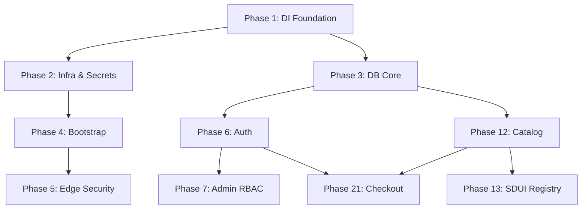

# CarBroz Project Baseline

> This document serves as "Snapshot 0" for the CarBroz Backend Platform, locking the exact state, violations, constraints, and architecture scores prior to the start of Phase 1.

## 1. Repository Overview
- **Branch**: `backend-production-foundation` (Integration Branch)
- **Commit Hash**: Baseline (Pre-Phase 1)
- **Workspace Packages**: `@carbroz/common`, `@carbroz/config`, `@carbroz/logger`, `@carbroz/database`, `@carbroz/events`, `@carbroz/feature-flags`, `@carbroz/messaging`, `@carbroz/observability`, `@carbroz/performance`, `@carbroz/providers`, `@carbroz/types`, `@carbroz/ui-sdk`, `@carbroz/validation`, `@carbroz/cache`.
- **Applications**: `backend-api`
- **Documentation Version**: 1.0.0 (Frozen)
- **Roadmap Version**: 1.0.0 (35 Phases)

## 2. Existing Modules
| Module | Status | Maturity | Architecture Score | Technical Debt | Planned Phase |
| :--- | :--- | :--- | :--- | :--- | :--- |
| **Auth** | MVP Exists | Broken | 1/10 | High | Phase 6 |
| **SDUI (UI)** | Static POC | Low | 4/10 | Medium | Phase 13 |
*(All other modules are NOT_STARTED)*

## 3. Existing Packages
| Package | Purpose | Implementation Status | Dependencies | Future Owner Phase |
| :--- | :--- | :--- | :--- | :--- |
| `@carbroz/common` | Shared errors, types, response models | Scaffolded | None | Phase 1 |
| `@carbroz/config` | Environment variables, `.env` parsing | Scaffolded | Zod | Phase 2 |
| `@carbroz/logger` | Pino configuration & wrappers | Scaffolded | Pino | Phase 5 |
| `@carbroz/database` | Prisma Client Generation | Schema Shell | Prisma | Phase 3 |
| `@carbroz/ui-sdk` | SDUI component typings and builders | Scaffolded | None | Phase 13 |
| `@carbroz/providers` | External infrastructure abstractions | Empty | None | Phase 7-9 |

## 4. Existing Infrastructure
| Infrastructure | Current State | Target State | Owner Phase |
| :--- | :--- | :--- | :--- |
| **PostgreSQL** | Running in Docker, schema empty | Aurora Serverless / HA Postgres | Phase 3 |
| **Redis** | Not Configured | AWS ElastiCache | Phase 2 |
| **BullMQ** | Not Configured | Fully Distributed Event Bus | Phase 8 |
| **MinIO** | Not Configured | S3 Compatible Storage | Phase 16 |
| **Docker** | Postgres Only | Full multi-container composition | Phase 2 & 35 |
| **Prisma** | Empty `schema.prisma` | Expand-and-Contract Migrations | Phase 3 |
| **Environment** | Basic `.env` | Remote Config & Vault Secrets | Phase 2 & 4 |
| **CI/CD** | None | Automated lint, build, test, deploy | Phase 35 |
| **Observability** | None | OpenTelemetry, Prometheus | Phase 5 |
| **Logging** | `console.log` heavily used | Structured Pino JSON logging | Phase 5 |

## 5. Existing Architecture Violations
| Violation | Severity | Location | Fix Phase |
| :--- | :--- | :--- | :--- |
| Direct DB access in Controller | Critical | `auth.controller.ts` | Phase 6 |
| Missing Prisma Models referenced | Critical | `auth.controller.ts` | Phase 3 |
| Lack of DI Container | High | Global | Phase 1 |
| `console.log` in Fastify Hooks | Medium | `app.ts` | Phase 5 |
| Missing Interface implementations | High | Domain Layer | Phase 1 |

## 6. Existing Technical Debt
- **Critical**: Broken Master State (`auth.controller.ts` crashes without missing DB models). No testing framework (Jest/Vitest).
- **High**: No Dependency Injection (DI) system exists. Hardcoded imports prevent mocking.
- **Medium**: SDUI JSONs are flat files rather than DB-backed configurations.
- **Low**: Inconsistent error code returns compared to `11_ERROR_CODES.md`.

## 7. Current Production Readiness
- **Architecture**: 1/10
- **Security**: 2/10
- **Testing**: 0/10
- **Infrastructure**: 1/10
- **Performance**: 3/10
- **Scalability**: 1/10
- **Observability**: 0/10
- **Deployment**: 0/10
- **Documentation**: 10/10

**Overall Score**: 2/10 (Pre-Implementation Baseline)

## 8. Phase Dependency Graph

*(Simplified visualization. Phases heavily build on 1, 2, and 3).*

## 9. Module Dependency Diagram
```text
[ SDUI Module ] ---> [ UI-SDK Package ] ---> [ Common Package ]
[ Auth Module ] ---> [ DB Package ] ---> [ Common Package ]
[ Booking Module ] ---> [ Dispatch Module ] ---> [ DB Package ]
```

## 10. Package Dependency Diagram
```text
@carbroz/common <--- (All Domain Packages)
@carbroz/config <--- (App, Logger, DB)
@carbroz/providers <--- (App, Auth, Booking)
```

## 11. Infrastructure Diagram
```text
[ Client ] ---> [ Fastify API (app) ]
[ Fastify API ] ---> [ PostgreSQL (Prisma) ]
[ Fastify API ] -x-> [ Redis (Pending) ]
[ Fastify API ] -x-> [ BullMQ (Pending) ]
```

## 12. Request Lifecycle Diagram
```text
HTTP Request -> Fastify -> Helmet/CORS -> Global Middlewares -> Router -> Controller -> [Zod Validation] -> UseCase -> Provider/Repository -> DB/Cache -> Controller -> ResponseHelper -> Client
```

## 13. SDUI Lifecycle Diagram
```text
Client GET /screen -> BaseScreenBuilder -> Fetch Template from DB -> Hydrate dynamic slots -> Apply Theme -> Generate UI JSON -> Return to Client -> Client UI Engine parses JSON
```

## 14. Booking Lifecycle Diagram
```text
Draft (Cart) -> Confirmed (Payment Auth) -> Finding Partner (Redis Geo) -> Partner Assigned -> En Route -> Service Started -> Service Completed -> Invoice Generated -> Rated
```

## 15. Partner Lifecycle Diagram
```text
Registration -> Document Upload -> KYC Background Check -> Training Module -> Admin Approval -> Available -> Booking Assigned -> Wallet Credited -> Weekly Payout
```

## 16. Decision Log (Frozen Architectural Decisions)
| Decision | Reason |
| :--- | :--- |
| **Modular Monolith** | Faster iteration while enforcing Clean Architecture. Enables future Microservices swap without rewrite. |
| **Provider Pattern** | Strict isolation of infrastructure. Zero business code changes for DB/Queue swaps. |
| **SDUI Locked Hierarchy** | Prevents fragmentation across Customer/Partner/Admin apps. |

## 17. Non-Negotiable Constraints
- **Clean Architecture**: Domain layer MUST have zero external dependencies.
- **Provider Pattern**: NO direct infrastructure imports in business logic.
- **SDUI Lock**: `screenId`, `templateId`, `components`, `children` hierarchy is ABSOLUTE.
- **Database Rules**: UUIDv7 for public IDs, UTC for time, Integers for Money.
- **Error Standard**: Domain-specific strings (`AUTH_TOKEN_EXPIRED`) must be returned.

## 18. Future Migration Guarantees
- **Database**: Swap `PostgreSQL` for `Aurora` by modifying `schema.prisma` connection strings only.
- **Cache**: Swap `Local Redis` for `ElastiCache` via `ICacheProvider`.
- **Queue**: Swap `BullMQ` for `Kafka` via `IQueueProvider`.
- **Storage**: Swap `MinIO` for `S3` via `IStorageProvider`.
- **Maps**: Swap `OSRM` for `Google Maps` via `IMapsProvider`.
- **Payments**: Swap `Razorpay` for `Stripe` via `IPaymentProvider`.
- **Notifications**: Swap `Twilio` for `SNS` via `INotificationProvider`.
- **Authentication**: Swap `Local JWT` for `Auth0` via `IAuthProvider`.
- **Search**: Swap `Postgres ILIKE` for `Elasticsearch` via `ISearchProvider`.

*Rule: The DI container resolves the concrete implementation. Zero UseCase changes required.*

## 19. Definition of Success
**Production Ready** means the platform supports 100,000+ DAU out of the box with:
- Zero architectural leakage between modules.
- 100% infrastructure abstraction via Providers.
- Double-entry accounting for financial stability.
- Zero-downtime Expand-and-Contract database migrations.
- Dynamic localized UI driven purely from the server.
- Near-instant response times for Catalog via Redis read-through caching.

## 20. Baseline Lock

- **STATUS**: FROZEN
- **VERSION**: 1.0.0
- **LAST_UPDATED**: Initial Baseline
- **MODIFICATION_RULE**: "This document can only be updated after successful completion of an approved execution phase."
