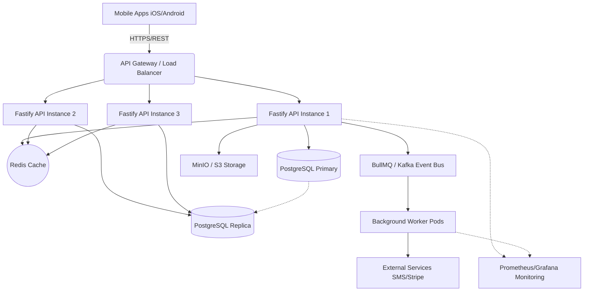

# CarBroz Backend - Scalability and Production Scenarios

This document serves as a backend architecture guide for founders, backend engineers, mobile engineers, and future team members of the CarBroz Platform. It explains real production problems that occur when an application scales from thousands to millions of users, along with industry-grade, highly scalable solutions leveraging the CarBroz technology stack.

## Technology Stack Context
- **Backend**: Node.js, Fastify, TypeScript
- **Database**: PostgreSQL, Prisma
- **Cache**: Redis
- **Queue**: BullMQ
- **Events**: Kafka (future scale)
- **Storage**: MinIO / AWS S3
- **Monitoring**: Pino, Prometheus, Grafana
- **Deployment**: Docker, Kubernetes / AWS ECS

---

## Scenario 1: Thousands of users opening the same Server Driven UI login screen simultaneously.

### Scenario
10,000 users open the CarBroz app at the exact same time during a massive marketing campaign, all landing on the initial login screen.

### What Happens Internally
- **API request flow**: 10,000 requests hit the `/api/v1/screen/auth_login` endpoint simultaneously.
- **Database interaction**: If the UI config is stored in DB, it triggers 10,000 identical `SELECT` queries.
- **Server resources affected**: Node.js event loop gets flooded. CPU spikes parsing and serializing the same large JSON object 10,000 times.
- **Failure points**: The database connection pool is exhausted, leading to timeouts and HTTP 503 Service Unavailable errors.

### Problems Created
- **Database overload**: Complete lockup of the DB preventing other critical operations (like processing actual bookings).
- **User experience impact**: Users stare at a blank screen or a loading spinner that never finishes. High churn rate on the first screen.

### Wrong Implementation Example
A beginner architecture dynamically queries the database for the login layout, reads all components, builds the JSON on the fly, and sends it back for every single request, hitting Postgres directly without a cache.

### Production Grade Solution
- **Redis caching strategy**: Since the Login UI doesn't change per user, the serialized JSON response is stored in Redis. The Fastify route first checks Redis `GET screen:auth_login`. If present, it serves it instantly from memory.
- **CDN usage**: For purely static, anonymous SDUI screens, place a CDN (like Cloudflare or AWS CloudFront) in front of the API. The CDN caches the JSON payload at the edge. 10,000 requests hit the CDN, and only 1 hits the CarBroz backend.
- **UI configuration loading**: Background jobs or Admin Panel webhooks trigger a Redis cache invalidation only when the UI is explicitly updated.

---

## Scenario 2: OTP request explosion.

### Scenario
During a flash sale, thousands of users request login OTPs concurrently. Malicious actors also attempt to spam phone numbers with OTP requests.

### What Happens Internally
- **API request flow**: Thousands of `POST /api/v1/auth/send_otp` requests hit the backend.
- **External API interaction**: Backend makes synchronous HTTP requests to the SMS provider (e.g., Twilio/MSG91).
- **Cost explosion**: SMS providers charge per message. Spam bots can drain thousands of dollars in minutes.
- **Failure points**: External SMS API rate limits are hit, causing genuine users to fail to receive OTPs.

### Problems Created
- **Performance issues**: Waiting for SMS provider HTTP responses blocks the Fastify event loop threads if not managed properly.
- **Business impact**: Massive financial loss from OTP abuse and loss of genuine customers who cannot log in.

### Wrong Implementation Example
The API controller directly calls the SMS provider SDK synchronously, inserts the OTP into the PostgreSQL database, and doesn't verify how many times the user has asked for an OTP in the last hour.

### Production Grade Solution
- **Rate limiting & Throttling**: Implement strict rate-limiting in Fastify using Redis. E.g., Max 3 OTP requests per phone number per 15 minutes. Implement IP-based and Device-ID-based throttling.
- **Queue/Event usage**: Push the SMS dispatch task to **BullMQ**. The backend responds immediately with `{"success": true}`. The BullMQ worker processes the queue and talks to the SMS provider, preventing backend lockup.
- **Redis temporary storage**: Store OTPs in Redis with a strict TTL (e.g., `SETEX otp:9876543210 300 "1234"`). Do NOT store OTPs in PostgreSQL.

---

## Scenario 3: OTP verification at huge scale.

### Scenario
Thousands of users who just received their OTPs submit them for verification at the same time.

### What Happens Internally
- **API request flow**: Users hit `/api/v1/auth/verify_otp`.
- **Database interaction**: Validating OTPs against a relational database creates massive Read/Write contention, index locking, and table bloating for ephemeral data.

### Problems Created
- **Database overload**: PostgreSQL transaction overhead for data that only lives for 5 minutes degrades the performance of core tables.
- **Performance issues**: Slower verification means slower login, frustrating users.

### Wrong Implementation Example
The backend queries the `Users` or `OtpLogs` table in Postgres, checks if it matches, and performs an SQL `UPDATE` to mark the OTP as used.

### Production Grade Solution
- **Redis temporary storage**: OTPs are inherently transient. The Fastify API performs a Redis `GET otp:<phone>`.
- **Expiry handling**: Redis natively handles expiration (TTL). If the key is gone, the OTP is invalid/expired.
- **Security considerations**: Upon successful verification, immediately `DEL otp:<phone>` from Redis to prevent replay attacks. Then, issue a JWT session and asynchronously upsert the user into the PostgreSQL database if they are new.

---

## Scenario 4: A Server Driven UI screen contains too much data.

### Scenario
The CarBroz Home Screen becomes massive, containing a Banner carousel, Categories, Services, Promotional Videos, Offers, Nearby partners, and 50 Recent Reviews.

### What Happens Internally
- **API request flow**: The `/api/v1/screen/home` endpoint serializes a massive nested object.
- **Network impact**: The backend sends a 3MB JSON payload over the network.
- **Memory usage**: Node.js allocates huge memory buffers to stringify the JSON.

### Problems Created
- **Performance issues**: High latency for the user downloading 3MB on a mobile network.
- **User experience impact**: The app feels slow, unresponsive, and consumes a lot of the user's mobile data.

### Wrong Implementation Example
The backend queries all tables (Banners, Categories, Services, Reviews) using deeply nested Prisma `include` statements, builds one monolithic UI tree, and sends it as a single HTTP response.

### Production Grade Solution
- **API response optimization**: The SDUI engine must support **Component-based loading** and **Lazy loading**.
- **Pagination**: The initial JSON only contains the structural skeleton, banners, and categories. The Reviews and Nearby Partners sections are returned as "Placeholder/Skeleton" components with a `lazyLoadUrl` action.
- **Execution**: The mobile app renders the top half instantly, and asynchronously fetches the bottom sections via parallel API calls, keeping the initial JSON under 50KB.

---

## Scenario 5: Mobile application memory issue because of huge dynamic UI JSON.

### Scenario
Even with optimized data, rendering a highly dynamic feed of hundreds of car wash services causes the mobile app to crash.

### What Happens Internally
- **JSON parsing memory usage**: The mobile app's JSON parser uses excessive RAM decoding huge payloads.
- **Rendering thousands of components**: The app attempts to keep 500 complex UI nodes in memory simultaneously.

### Problems Created
- **Memory problems**: OutOfMemory (OOM) exceptions crash the app on lower-end Android devices.
- **User experience impact**: Severe frame drops (jank) while scrolling.

### Wrong Implementation Example
The SDUI payload contains an array of 500 service items inside a standard Column component. The mobile app attempts to render them all at once on the main UI thread.

### Production Grade Solution
- **Compose LazyColumn/LazyRow strategy**: The backend SDUI payload must explicitly define components as `list_template` or `lazy_column`. 
- **Virtual rendering**: This signals the Compose Multiplatform engine to use `LazyColumn`, which only allocates memory for the UI items currently visible on the screen.
- **Pagination**: The backend implements cursor-based pagination. The SDUI list component includes an `onEndReached` action that fetches the next page of JSON UI nodes.

---

## Scenario 6: Database becomes slow after millions of records.

### Scenario
After a year of successful operations, the `Booking`, `Users`, `Payments`, and `Services` tables have accumulated millions of rows. Simple queries start timing out.

### What Happens Internally
- **Database interaction**: A simple `SELECT * FROM Booking WHERE userId = X` requires a full table scan.
- **Server resources affected**: Postgres CPU spikes, memory buffers fill up, and connection pools become exhausted waiting for slow queries to return.

### Problems Created
- **Timeout scenarios**: API requests exceed the 10-second timeout, resulting in HTTP 504 Gateway Timeout.
- **Business impact**: Customers cannot view their booking history; partners cannot see their upcoming schedules.

### Wrong Implementation Example
Keeping all data in a single monolithic table without indexes, querying historical data (from 2 years ago) directly on the primary database, and opening a new DB connection per request.

### Production Grade Solution
- **Indexing**: Apply B-Tree indexes on highly queried foreign keys (e.g., `userId`, `partnerId`, `status`). 
- **Query optimization**: Avoid `SELECT *`. Select only required fields. Avoid deep `JOIN` operations on large tables.
- **Read replicas**: Route heavy `SELECT` queries (like user booking history) to Postgres Read Replicas, leaving the Primary instance free for `INSERT`/`UPDATE` operations.
- **Database partitioning**: Partition the `Booking` and `Payments` tables by date (e.g., monthly partitions) so queries for "active bookings" only scan a tiny fraction of the total data.
- **Connection pooling**: Use PgBouncer or Prisma Accelerate to multiplex thousands of API connections into a small pool of actual Postgres connections.

---

## Scenario 7: Booking slot race condition.

### Scenario
A premium slot (Saturday 10:00 AM) is available for a popular car wash partner. Two users click "Book Now" at the exact same millisecond.

### What Happens Internally
- **Concurrent requests**: Two isolated Node.js event loops check if the slot is available. Both queries return `true`.
- **Database interaction**: Both requests proceed to `INSERT` a booking for the same slot.

### Problems Created
- **Duplicate booking issue**: The partner receives two confirmed bookings for the exact same time, causing operational chaos, angry customers, and refund disputes.

### Wrong Implementation Example
The use case merely performs a `SELECT` to check availability, followed by an `INSERT` to book, assuming no one else will book it in the 50 milliseconds between the two queries.

### Production Grade Solution
- **Database locking**: Use PostgreSQL transactional locks (e.g., `SELECT ... FOR UPDATE`) to lock the partner's availability row so the second request must wait until the first is resolved.
- **Distributed lock (Redis Redlock)**: For distributed systems, acquire a lock in Redis (`SET lock:partner:123:slot:10am NX PX 5000`). The first user gets the lock, processes the booking, and releases it. The second user fails to get the lock and is returned a "Slot no longer available" error cleanly.

---

## Scenario 8: Payment succeeds but booking creation fails.

### Scenario
A user pays $50 for a wash via a payment gateway (e.g., Stripe/Razorpay). The payment succeeds, but a sudden network glitch or database error prevents the backend from creating the `Booking` record.

### What Happens Internally
- **Distributed transaction problem**: The payment system (external) committed the transaction, but the internal database rolled back. 

### Problems Created
- **Business impact**: The customer's card is charged, but they have no booking. Customer support is flooded with angry calls.

### Wrong Implementation Example
The API calls the Payment Gateway synchronously, waits for the success response, and then tries to `INSERT` the booking. If the `INSERT` throws a Prisma error, the request dies, and the money is lost in limbo.

### Production Grade Solution
- **Event-driven architecture**: Implement the Saga pattern or Webhook-first flow. 
- **Payment events**: The frontend initiates payment. The backend records a `PENDING` booking. The payment gateway hits a backend webhook `POST /api/v1/payment/webhook`.
- **Booking consumers**: The webhook publishes a `PaymentSucceeded` event to BullMQ/Kafka. A background worker consumes this event and confirms the booking.
- **Retry mechanism & Dead letter queue**: If the worker fails to update the database, it retries automatically with exponential backoff. If it completely fails, it moves to a Dead Letter Queue (DLQ) where an admin can manually intervene, guaranteeing no data is permanently lost.

---

## Scenario 9: Backend server crashes during high traffic.

### Scenario
A memory leak or unhandled exception causes the main Node.js Fastify instance to crash completely during peak hours.

### What Happens Internally
- **Single server failure**: The OS kills the Node.js process. 
- **Network impact**: Incoming TCP connections are instantly dropped.

### Problems Created
- **Business impact**: 100% downtime. Total loss of revenue until an engineer manually restarts the server.

### Wrong Implementation Example
Running the app on a single AWS EC2 instance using `node server.js` or `pm2` without auto-scaling. If the instance dies, the app is dead.

### Production Grade Solution
- **Horizontal scaling**: Containerize the app using Docker. Run the containers in Kubernetes (K8s) or AWS ECS.
- **Load balancer**: Place an Application Load Balancer (ALB) in front. Run at least 3 identical instances (pods) of the API across different availability zones.
- **Auto scaling**: Configure Kubernetes HPA (Horizontal Pod Autoscaler) to automatically spin up more instances if CPU usage exceeds 70%. If one instance crashes, the Load Balancer routes traffic to the healthy ones while K8s automatically spins up a replacement pod.

---

## Scenario 10: Users with poor network connectivity.

### Scenario
Customers in areas with slow 3G/4G networks, high latency, and packet loss try to load the heavy Server Driven UI and images.

### What Happens Internally
- **Network impact**: The 500KB JSON payload and 3MB of banner images take 15 seconds to download. TCP congestion control slows down the transfer further.

### Problems Created
- **User experience impact**: The user stares at a blank screen, assumes the app is broken, and uninstalls it.

### Wrong Implementation Example
Sending uncompressed JSON and serving raw `.png` or `.jpg` images directly from the local file system.

### Production Grade Solution
- **API compression**: Enable **Brotli** or **Gzip** compression in Fastify. JSON compresses extremely well, shrinking a 500KB payload to 50KB.
- **Image optimization**: Serve all UI assets via a CDN with automatic format conversion to **WebP** or **AVIF**, dynamically resizing images based on the mobile device's screen density (e.g., `?width=400&format=webp`).
- **Offline-first architecture & Local caching**: The mobile app caches the SDUI layout JSON locally. On next launch, it instantly renders the cached UI while fetching the updated JSON in the background.

---

## Scenario 11: Server Driven UI version mismatch.

### Scenario
The backend team introduces a shiny new `carousel_video` component for the SDUI engine. They deploy the backend. However, a user opens the app on a 2-month-old version of the iOS app that has no native renderer for `carousel_video`.

### What Happens Internally
- **API request flow**: The backend sends the new JSON payload containing `{ type: "carousel_video" }`.
- **App rendering**: The mobile app parser encounters an unknown component type.

### Problems Created
- **User experience impact**: The mobile app crashes with an unknown type exception, or renders a massive blank white space.

### Wrong Implementation Example
Pushing changes to the live UI configuration without checking the `App-Version` header sent by the client.

### Production Grade Solution
- **Component versioning**: The frontend must send its supported SDUI version in headers (e.g., `X-SDUI-Version: 1.2`). 
- **Backward compatibility**: The `UIController` parses this header. If the client is old, the `ScreenFactory` degrades gracefully and sends a static `image_banner` instead of a `carousel_video`.
- **Fallback rendering**: The mobile SDUI engine must implement an `UnknownComponentRenderer` that silently drops unrecognized components rather than crashing the app.

---

## Scenario 12: Backend API changes without breaking old applications.

### Scenario
The business requires changing the booking creation payload from `serviceId: string` to an array `serviceIds: string[]`. 

### What Happens Internally
- **Mobile apps are not updated immediately**: Unlike websites, you cannot force users to instantly update native mobile apps. 
- **API execution**: Old apps continue sending `serviceId: string`.

### Problems Created
- **Business impact**: Zod validation throws a 400 Bad Request for all older app versions, completely breaking the booking flow for 40% of the user base.

### Wrong Implementation Example
Modifying the existing controller and DTO in place and deploying it, assuming everyone is on the latest app version.

### Production Grade Solution
- **API versioning**: Create a new route `/api/v2/booking` while keeping `/api/v1/booking` intact.
- **Migration strategy**: The `/v1/` endpoint maps the old `serviceId` into an array, then calls the exact same underlying Application Use Case. Both versions are supported until analytics show v1 traffic dropping below 1%, at which point it is sunset safely.

---

## Scenario 13: Production debugging.

### Scenario
A high-value enterprise customer calls support and says, "My payment went through, but my booking failed with a weird error."

### What Happens Internally
- Support escalates to engineering. Engineers look at thousands of logs streaming per second.

### Problems Created
- **Performance issues**: Engineers spend hours grep-ping through raw text logs across multiple servers, unable to connect the payment log to the booking error log.

### Wrong Implementation Example
Using `console.log("Booking failed")` which outputs unstructured text without context.

### Production Grade Solution
- **Structured logging**: Use **Pino** to output JSON logs.
- **Request ID**: Inject a unique `traceId` (UUID) via Fastify middleware into every request. Attach this `traceId` to every log line, database query, and background job event related to that request.
- **Distributed tracing**: Return the `traceId` in the API error response to the client. The customer gives the support agent the `traceId`. The engineer queries Grafana/Elasticsearch for `traceId=12345` and sees the exact sequence of events, identifying the exact line of code that failed in seconds.

---

## Scenario 14: Backend grows and one codebase becomes difficult.

### Scenario
The CarBroz engineering team grows from 2 to 30 developers. The monolithic codebase has 500 API endpoints. Deployments become scary, and a bug in the Notification module crashes the Payment module.

### Evolution Strategy

- **Stage 1: Modular Monolith (Current State)**
  The CarBroz backend strictly separates boundaries using folders (e.g., `modules/auth`, `modules/booking`). Modules communicate via internal Domain Events, not direct function calls.

- **Stage 2: Service boundaries**
  When traffic grows, we deploy the *exact same codebase*, but configure instances differently. Instance A only mounts `/api/v1/booking` (Booking API), and Instance B runs BullMQ (Worker).

- **Stage 3: Microservices only when required**
  If the Booking domain requires a completely different scaling profile or language (e.g., Go for high concurrency), it is extracted into a standalone service.
  - **Auth service**
  - **Booking service**
  - **Payment service**
  - **Notification service**
  Communication shifts from internal events to a Kafka/RabbitMQ event bus.

---

## Scenario 15: Changing UI/business logic without app release.

### Scenario
Marketing wants to launch a "Monsoon Wash Sale" tomorrow, changing the home screen layout, adding a new promotional banner, and re-ordering the service list.

### What Happens Internally
- Apple App Store review takes 2-4 days. An app release is impossible.

### Production Grade Solution
- **Server Driven UI System**: 
  - **Admin Panel**: Marketing uploads the image and tweaks the layout via a visual dashboard.
  - **UI Configuration**: The configuration is saved to the database.
  - **Backend**: The `ScreenFactory` pulls the new layout JSON and updates Redis.
  - **Mobile Application**: On next launch, the mobile app pulls the new JSON payload and immediately renders the "Monsoon Wash Sale" design, completely bypassing App Store approvals.
- **Feature Flags**: Roll out the new UI only to 10% of users first (A/B testing) to monitor conversion rates before rolling it out to 100%.

---
---

# Production Architecture Blueprint

## Complete Backend Flow Diagram

### Component Responsibility
- **API Gateway**: Handles SSL termination, rate limiting, and routes traffic.
- **Fastify API Instances**: Stateless application servers running business logic.
- **Redis**: High-speed ephemeral storage for SDUI JSON, OTPs, and Rate Limiting.
- **PostgreSQL**: Source of truth for relational business data (Users, Bookings).
- **Queue/Event System**: Offloads heavy tasks (notifications, reports) to prevent API blocking.
- **Storage**: Hosts binary assets (images, PDFs).
- **Monitoring**: Collects metrics and logs for observability.

---

# Server Driven UI Architecture

- **UI template storage**: Base layouts (e.g., `form_template`, `list_template`) defined in TypeScript builders or database.
- **Component registry**: The `ScreenFactory` dynamically maps IDs to rendering logic.
- **Renderer engine**: Fastify controllers build deep JSON trees using utilities (`UI.component()`).
- **Action dispatcher**: JSON defines actions (e.g., `type: api_call, endpoint: auth/send_otp`). The mobile app executes these blindly.
- **Version management**: Handled via `X-SDUI-Version` headers.
- **Cache strategy**: JSON is aggressively cached in Redis and CDNs.
- **Fallback strategy**: Client handles unknown types gracefully.

---

# Database Scaling Strategy

- **Schema design principles**: Normalize for integrity, denormalize for read performance if necessary. Use UUIDs or CUIDs for primary keys to allow distributed generation.
- **Indexing**: Always index foreign keys and columns used in `WHERE` clauses.
- **Query optimization**: Avoid `SELECT *`. Avoid N+1 queries by using Prisma `include` properly.
- **Transactions**: Keep transactions short. Avoid external API calls inside a DB transaction block.
- **Replication**: Use Read Replicas to scale read-heavy workloads (reporting, history).
- **Partitioning**: Partition massive tables (logs, old bookings) by time ranges.

---

# API Design Guidelines

- **GET**: Fetch data. Must be idempotent and cacheable. No side effects.
- **POST**: Create new resources or execute complex actions (e.g., login).
- **PUT**: Fully replace a resource.
- **PATCH**: Partially update a resource (e.g., change booking status).
- **DELETE**: Remove (or soft-delete) a resource.

### Best Practices
- **Request validation**: Strict Zod validation on every route.
- **Response format**: Uniform wrapper `{ success, data, message, traceId }`.
- **Pagination**: Use cursor-based pagination for infinite scroll feeds, limit/offset for data tables.
- **Filtering & Sorting**: Standardize query parameters (`?status=ACTIVE&sort=-createdAt`).

---

# Security Guidelines

- **Authentication**: Stateless JWT for scalability. Store a short-lived Access Token in memory, Long-lived Refresh Token in secure HTTP-only cookies or encrypted mobile storage.
- **OTP security**: Limit requests. Expire fast. Invalidate on use.
- **Rate limiting**: Global limits for all endpoints. Stricter limits for `/auth` and `/payments`.
- **Input validation**: Never trust client payloads. Validate types, lengths, and formats.
- **SQL injection prevention**: Prisma naturally parameterizes queries, avoiding injection.

---

# Observability

- **Logs**: Structured JSON logging (Pino) attached to a `traceId`.
- **Metrics**: Track HTTP response times, DB query times, memory usage (Prometheus).
- **Traces**: End-to-end distributed tracing across API and Workers.
- **Alerts**: Grafana alerts sent to Slack/PagerDuty when 5xx errors spike or CPU exceeds 85%.

---

# Golden Rules For Scalable Applications

1. **Never hit database unnecessarily.** Use caching (Redis) for read-heavy, infrequently changing data.
2. **Never send unnecessary data.** Implement strict pagination, field selection, and lazy loading.
3. **Never trust the client.** Validate every request payload and parameter backend-side.
4. **Never block APIs with heavy tasks.** Push emails, SMS, and reports to asynchronous queues (BullMQ).
5. **Never require app release for every UI change.** Leverage the Server Driven UI architecture.
6. **Temporary data belongs in Redis.** Never pollute PostgreSQL with OTPs or temporary rate-limit counters.
7. **Design for 10x future traffic.** Write code that won't break when user load multiplies.
8. **Every important action should be observable.** If it isn't logged or metric-tracked, you can't debug it.
9. **Every failure should have a retry strategy.** Use exponential backoffs and Dead Letter Queues for background jobs.
10. **Every service should be independently scalable.** Stateless APIs are non-negotiable. 
