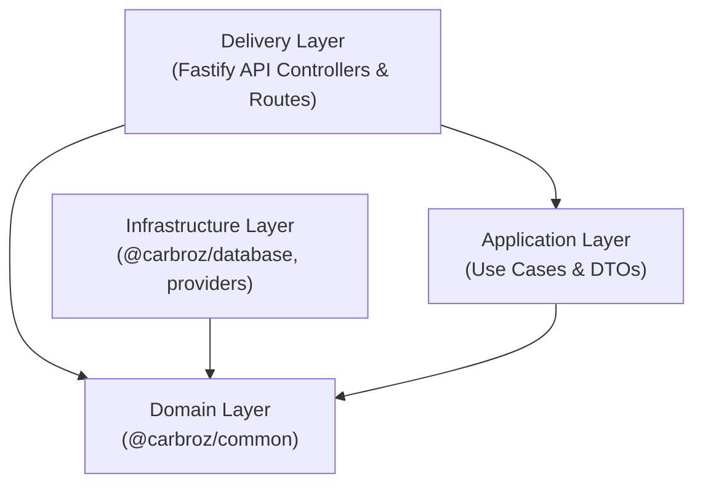

# 02 — Clean Architecture Audit

---

## 1. Clean Architecture Dependency Graph

- **Rule Verification**: Domain layer (`packages/common/src/domain/`) has **ZERO dependencies** on external frameworks, Fastify, Prisma, or infrastructure details.
- **Provider Pattern Verification**: Infrastructure components implement interfaces declared in domain layer (e.g., `ISduiRegistryRepository`, `IUserRepository`, `IStorageProvider`, `IMapsProvider`).

---

## 2. Identified Clean Architecture Findings

| Issue ID | File / Component | Category | Severity | Findings & Recommendation |
| :--- | :--- | :--- | :--- | :--- |
| CA-001 | `packages/common/src/domain/sdui/repositories/ISduiRegistryRepository.ts` | Domain Repository Contract | Medium | Contract retains `registerComponent()` alias alongside `createComponent()`. **Recommendation**: Deprecate legacy alias in next phase. |
| CA-002 | `apps/backend-api/src/modules/sdui/use-cases/RegisterSduiComponentUseCase.ts` | Use Case Alias | Low | File acts as alias re-export for `CreateSduiComponentUseCase.ts`. **Recommendation**: Retain for backwards compatibility during migration, remove in release cleanup. |
| CA-003 | `@carbroz/types` package | Shared Types | Low | Package duplicates basic response types in `@carbroz/common`. **Recommendation**: Consolidate types into `@carbroz/common`. |
