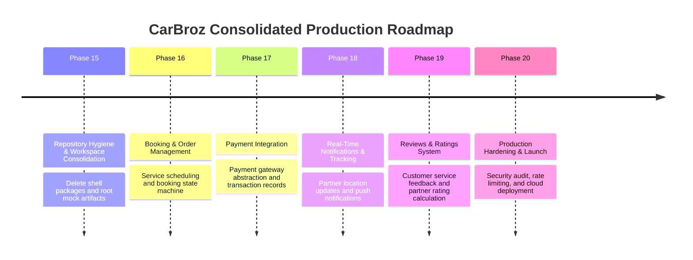

# 13 — Consolidated Production-Focused MVP Roadmap

---

## Consolidated 6-Phase MVP Roadmap

---

### Phase Summary Table

| Phase | Phase Name | Scope & Objective | Key Deliverables | Risk Level |
| :--- | :--- | :--- | :--- | :--- |
| **Phase 15** | Repository Hygiene & Consolidation | Remove 5 shell packages, root mock files, consolidate `@carbroz/types`. | Monorepo cleanup, streamlined workspace build. | Low |
| **Phase 16** | Booking & Order State Machine | Customer booking creation, scheduling, partner assignment workflow. | Booking domain model, state transition engine, APIs. | Medium |
| **Phase 17** | Payment & Wallet Gateway | Payment processing integration, invoice generation, refunds. | Payment provider abstraction, transaction repository. | Medium |
| **Phase 18** | Real-Time Tracking & Push Notifications | Live location updates, SMS/Push notification alerts. | WebSockets/SSE integration, notification provider. | Medium |
| **Phase 19** | Customer Feedback & Ratings | Ratings, service reviews, partner performance metrics. | Review domain entity, rating calculation engine. | Low |
| **Phase 20** | Production Hardening & Cloud Launch | Security hardening, rate-limiting, CI/CD automated release. | Docker image, deployment scripts, monitoring alerts. | High |
