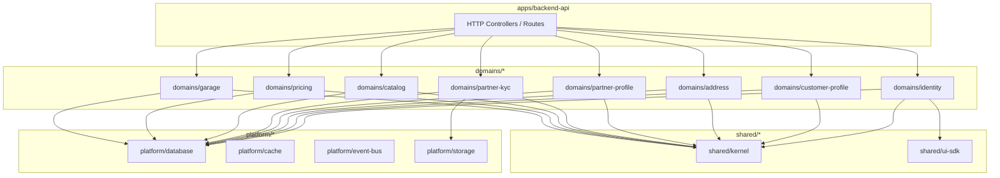

# Core Business Domains Dependency Analysis — Milestone 2

Detailed dependency mapping and coupling graph for Milestone 2 Core Domains.

## Domain Dependency Graph

---

## Inter-Domain Dependency Rules & Directives

1. **Strict Encapsulation**: Domains must import ONLY from another domain's `public/index.ts`. Deep imports into internal folders (`domain/`, `application/`, `infrastructure/`) across domain boundaries are strictly prohibited.
2. **Unidirectional Dependency Flow**:
   - `apps/` → `domains/` → `platform/` → `shared/`
   - Zero upward dependencies from `shared/` or `platform/` to `domains/` or `apps/`.
3. **DI Auto-Registration**: Each domain registers its dependencies (repositories, use cases) via its own Awilix DI module file (e.g. `identity.module.ts`).
