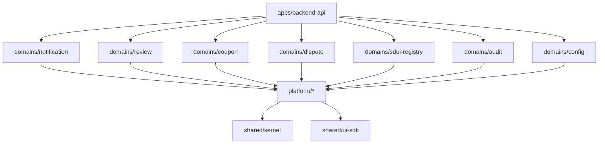

# Milestone 4 — Dependency & Coupling Analysis

Dependency directional mapping for Engagement Domains.

## Directional Coupling Constraints

1. No domain package in `domains/` may import from `apps/`.
2. Engagement domain packages must interact with each other via public barrels (`@carbroz/domain-notification`, etc.) or domain events.
3. No direct circular imports between `review`, `coupon`, and `dispute`.
