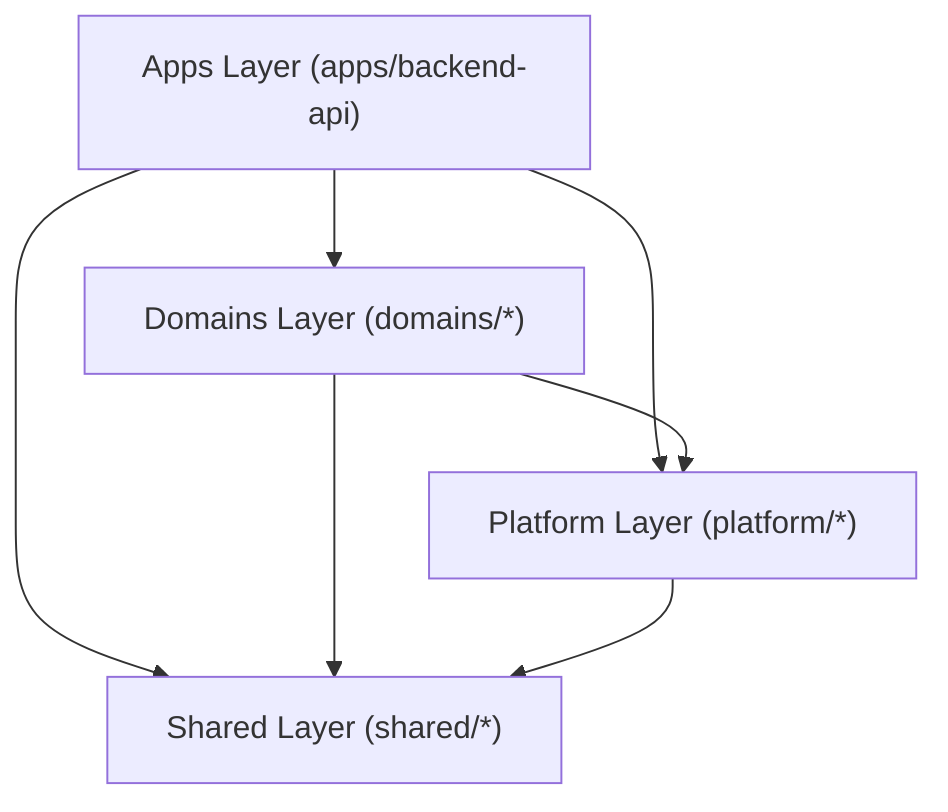

# Milestone 5 — Dependency & Layering Analysis

Comprehensive dependency architecture audit for Milestone 5 (Legacy Pruning & Final Stabilization).

## 1. 4-Pillar Layering Matrix

---

## 2. Layering Rule Verification

1. **`apps/`**: Depends on `domains/`, `platform/`, `shared/`. No domain imports from `apps/`.
2. **`domains/`**: Depends on `platform/` and `shared/`. Cross-domain imports are restricted strictly to public barrels (`@carbroz/domain-<name>`).
3. **`platform/`**: Depends on `shared/`. Cannot import from `domains/` or `apps/`.
4. **`shared/`**: Base foundation (`kernel`, `ui-sdk`). Zero dependencies on `domains/`, `platform/`, or `apps/`.

---

## 3. Deep Imports & Public Barrel Auditing

- **Rule**: All imports into domain packages must use `@carbroz/domain-<name>` public barrels. No relative path traversing (`../../domains/foo/src/...`).
- **Audit Result**: Clean. All imports resolve via workspace package exports in `package.json` (`dist/public/index.js`).
