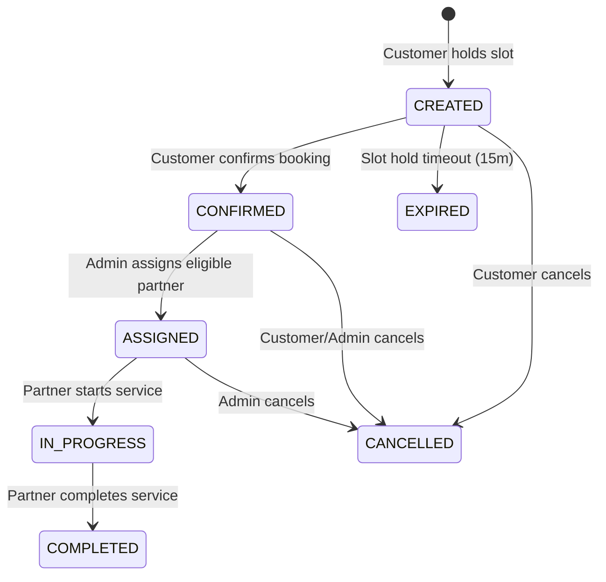

# Phase 16 — Customer Vehicle Garage & Service Booking Engine Implementation Plan

## 1. Repository Findings & Baseline Audit
- **Customer Identity**: Reuses `CustomerProfile` (`userId`) and `Address` entities.
- **Partner Identity**: Reuses `Partner` (`PARTNER_ACTIVE` status verification) and `PartnerMember`.
- **Catalog & Pricing**: Reuses `Service`, `ServiceAddon`, `PricingTier`, and `CalculateServicePriceUseCase`.
- **Transaction Engine**: Reuses `PrismaTransactionProvider` for transactional booking creation and slot reservation.

---

## 2. Scope & Out of Scope
### Scope
- Customer Vehicle Garage (`Vehicle` entity CRUD, default vehicle flag).
- `Booking` aggregate with commercial snapshots (`BookingServiceSnapshot`, `BookingAddonSnapshot`, `BookingPriceSnapshot`, `BookingAddressSnapshot`, `BookingVehicleSnapshot`).
- Booking State Machine (`CREATED → CONFIRMED → ASSIGNED → IN_PROGRESS → COMPLETED → CANCELLED → EXPIRED`).
- Transactional Slot Reservation & Slot Expiration Worker.
- Partner Assignment & Overlap Prevention.

### Out of Scope
- Payment Processing Gateway (Phase 17).
- Live Real-Time WebSockets Location Tracking (Phase 18).
- Push Notifications & SMS Delivery (Phase 18).
- Promotional Coupon Discounts (Phase 19).

---

## 3. Vehicle Domain Design
- **Entity**: `Vehicle` (`id`, `publicId`, `customerId`, `make`, `model`, `variant`, `year`, `registrationNumber`, `fuelType`, `color`, `nickname`, `isDefault`, `deletedAt`).
- **Invariants**: Single default vehicle per customer; archived vehicles forbidden in new bookings; customer access isolation.

---

## 4. Booking Aggregate Design
- **Core Aggregate Root**: `Booking` (`id`, `publicId`, `customerId`, `partnerId`, `vehicleId`, `addressId`, `serviceId`, `status`, `slotStartTime`, `slotEndTime`, `expiryAt`, `snapshots`).
- **Commercial Snapshots**: Money stored strictly in integer paise (`basePricePaise`, `addonsTotalPaise`, `taxesPaise`, `totalPricePaise`). Immutable historical snapshots prevent post-confirmation catalog changes from affecting existing bookings.

---

## 5. Booking State Machine


---

## 6. Slot Reservation & Double-Booking Prevention
- **Slot Hold**: 15-minute temporary hold (`expiryAt`).
- **Database Lock**: `SELECT ... FOR UPDATE` inside `PrismaTransactionProvider` prevents concurrent double-booking of identical slot/partner combinations.

---

## 7. Partner Assignment Design
- **Admin Assignment**: Endpoint `POST /api/v1/admin/bookings/:bookingId/assign`.
- **Validation**: Partner must be `ACTIVE`; partner member must have no overlapping assigned bookings.

---

## 8. Background Expiration Strategy
- **Worker**: Database polling worker (`ExpirePendingBookingsUseCase`) checking `WHERE status = 'CREATED' AND expiryAt < NOW()`. Operates safely without external queue dependencies.

---

## 9. Proposed Prisma Models
```prisma
enum VehicleStatus {
  ACTIVE
  ARCHIVED
}

enum BookingStatus {
  CREATED
  CONFIRMED
  ASSIGNED
  IN_PROGRESS
  COMPLETED
  CANCELLED
  EXPIRED
}

model Vehicle {
  id                 Int           @id @default(autoincrement())
  publicId           String        @unique @default(uuid()) @map("public_id")
  customerId         Int           @map("customer_id")
  make               String
  model              String
  variant            String?
  year               Int
  registrationNumber String        @map("registration_number")
  fuelType           String        @map("fuel_type")
  color              String?
  nickname           String?
  isDefault          Boolean       @default(false) @map("is_default")
  status             VehicleStatus @default(ACTIVE)
  createdAt          DateTime      @default(now()) @map("created_at")
  updatedAt          DateTime      @updatedAt @map("updated_at")
  deletedAt          DateTime?     @map("deleted_at")

  customer CustomerProfile @relation(fields: [customerId], references: [id], onDelete: Cascade)
  bookings Booking[]

  @@index([customerId, status])
  @@map("vehicles")
}

model Booking {
  id               Int           @id @default(autoincrement())
  publicId         String        @unique @default(uuid()) @map("public_id")
  customerId       Int           @map("customer_id")
  partnerId        Int?          @map("partner_id")
  vehicleId        Int           @map("vehicle_id")
  addressId        Int           @map("address_id")
  serviceId        Int           @map("service_id")
  status           BookingStatus @default(CREATED)
  slotStartTime    DateTime      @map("slot_start_time")
  slotEndTime      DateTime      @map("slot_end_time")
  expiryAt         DateTime?     @map("expiry_at")
  totalPricePaise  Int           @map("total_price_paise")
  snapshotsJson    Json          @map("snapshots_json")
  createdAt        DateTime      @default(now()) @map("created_at")
  updatedAt        DateTime      @updatedAt @map("updated_at")

  customer CustomerProfile @relation(fields: [customerId], references: [id], onDelete: Restrict)
  partner  Partner?        @relation(fields: [partnerId], references: [id], onDelete: SetNull)
  vehicle  Vehicle         @relation(fields: [vehicleId], references: [id], onDelete: Restrict)

  @@index([customerId, status])
  @@index([partnerId, status])
  @@index([slotStartTime, slotEndTime])
  @@map("bookings")
}
```

---

## 10. Use Cases & API Endpoints
- `CreateVehicleUseCase` (`POST /api/v1/vehicles`)
- `ListCustomerVehiclesUseCase` (`GET /api/v1/vehicles`)
- `CreateBookingUseCase` (`POST /api/v1/bookings`)
- `ConfirmBookingUseCase` (`POST /api/v1/bookings/:bookingId/confirm`)
- `AssignPartnerToBookingUseCase` (`POST /api/v1/admin/bookings/:bookingId/assign`)
- `TransitionBookingStatusUseCase` (`PATCH /api/v1/bookings/:bookingId/status`)
- `CancelBookingUseCase` (`POST /api/v1/bookings/:bookingId/cancel`)
- `ExpirePendingBookingsUseCase` (Background task)

---

## 11. Acceptance Criteria
1. Single default vehicle enforced per customer.
2. Concurrent booking confirmation for same slot safely rejected.
3. Commercial price and address snapshots stored in paise.
4. Partner assignment fails if partner status is not `ACTIVE`.
5. 100% test pass rate across new and existing test suites.
