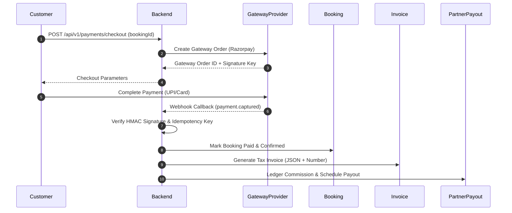

# Phase 17 — Payment Gateway, Invoicing & Partner Payout Engine Implementation Plan

## 1. Repository Findings & Integration Strategy
- **Booking Integration**: Integrates directly with `Booking` aggregate (`CONFIRMED` status trigger). Reuses commercial snapshot values (`totalPricePaise`).
- **Partner Payout Integration**: Links to `Partner` aggregate (`partnerId`, `PARTNER_ACTIVE` status check).
- **Transaction Safety**: Reuses `PrismaTransactionProvider` for idempotent payment state updates and payout ledgering.

---

## 2. Recommended Domain Design & Aggregates
- **Aggregates**:
  1. `Payment` (Aggregate Root): Represents customer payment transactions, gateway order references, payment status (`PENDING`, `SUCCESS`, `FAILED`, `REFUNDED`), and attempt history.
  2. `Invoice` (Aggregate Root): Commercial tax invoice for a completed/confirmed booking.
  3. `PartnerPayout` (Aggregate Root): Partner settlement ledger item.
  4. `Refund` (Entity under `Payment` or standalone aggregate root).

---

## 3. Value Objects & Enums
- **Enums**:
  - `PaymentStatus`: `PENDING`, `SUCCESS`, `FAILED`, `REFUNDED`
  - `PaymentMethod`: `CARD`, `UPI`, `NETBANKING`, `WALLET`, `CASH_ON_DELIVERY`
  - `InvoiceStatus`: `ISSUED`, `PAID`, `VOID`
  - `PayoutStatus`: `SCHEDULED`, `PROCESSING`, `PAID`, `FAILED`
- **Value Objects**:
  - `Money` (storing `amountPaise: number`, `currency: string`)
  - `TaxBreakdown` (storing `cgstPaise`, `sgstPaise`, `igstPaise`)

---

## 4. Payment Flow & State Machine

---

## 5. Payment Provider Recommendation
- **Recommendation**: **Razorpay** (with Stripe interface abstraction).
- **Reasoning**: Optimized for Indian market (UPI, NetBanking, RuPay, zero-friction webhooks, native INR settlement). Abstrahitized via `IPaymentGatewayProvider` interface to prevent vendor lock-in.

---

## 6. Invoice & Partner Payout Strategy
- **Invoice**: JSON tax invoice generation in MVP (storing GSTIN, tax split, sequential invoice number e.g. `INV-2026-00001`). PDF rendering deferred to background worker.
- **Partner Payout**: Weekly batch settlement calculation (`grossAmountPaise`, `commissionPaise` (e.g. 15%), `tdsPaise` (1% u/s 194O), `netPayoutPaise`).

---

## 7. Security Requirements
- Mandatory HMAC-SHA256 signature verification on gateway webhooks.
- Idempotency key tracking on `payment_webhooks` table (`event_id` unique constraint).
- Database locks (`SELECT ... FOR UPDATE`) during payment status mutation.

---

## 8. Items Deferred (Non-MVP)
- Partial refunds and partial split payments.
- Multi-currency conversion.
- Automated instant payout bank transfer via RazorpayX APIs (manual batch trigger in MVP).

---

## 9. Final Status: **READY FOR APPROVAL**
