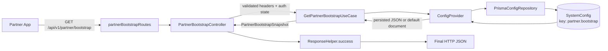
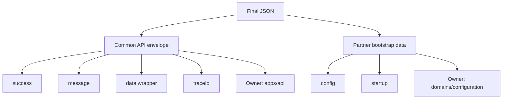
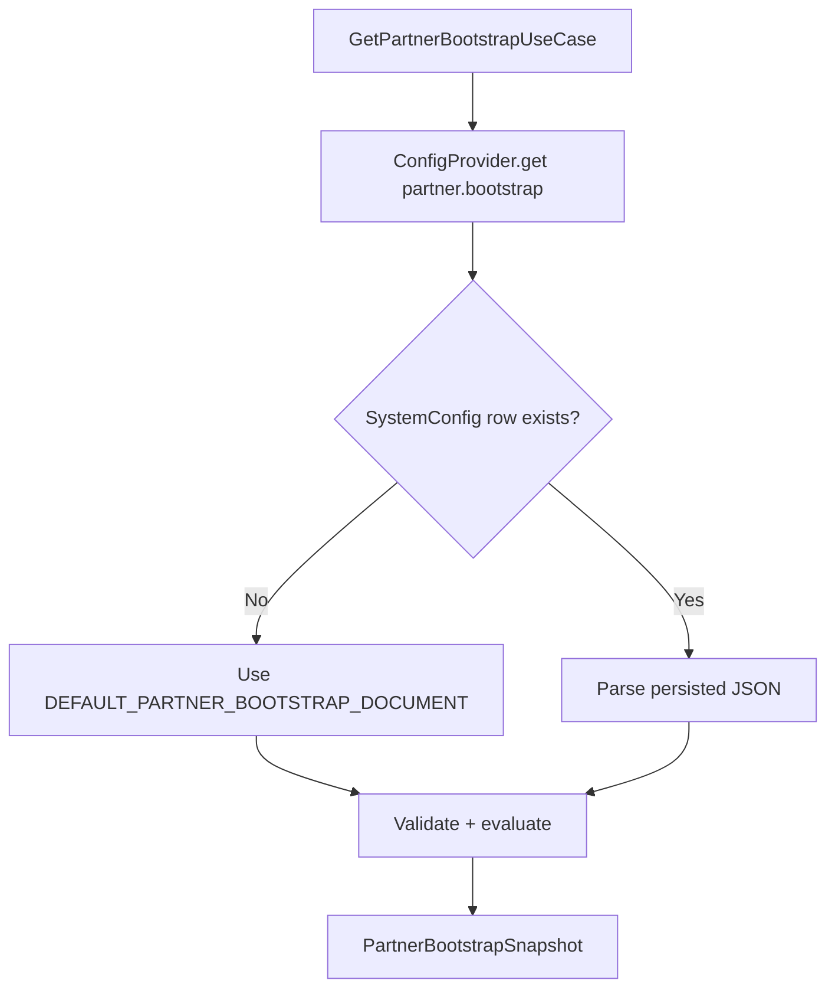
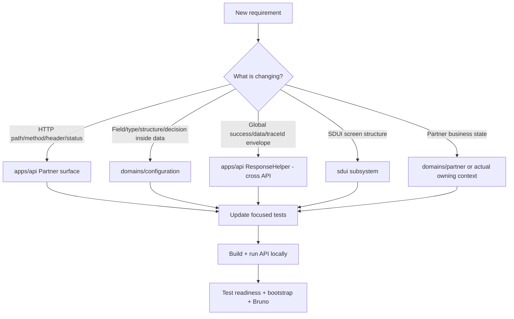

# Partner Bootstrap Configuration — Developer Guide

> **Owner:** `domains/configuration`  
> **HTTP consumer:** Partner API surface under `/api/v1/partner/*`  
> **Current endpoint:** `GET /api/v1/partner/bootstrap`  
> **Persisted key:** `partner.bootstrap`  
> **Architecture authority:** `docs/MASTER-BACKEND-CONSTITUTION.md` §19

This document explains **where the Partner bootstrap response comes from and exactly what to change when its request, endpoint, configuration, response fields, names, or structure must change**.

---

## 1. 60-second mental model

The Partner bootstrap is the first small startup contract used by the Partner app. It answers questions such as:

- Is the app under maintenance?
- Is an update required or optional?
- Which startup features are enabled?
- Is the current request authenticated?
- Which SDUI screen should the app load next?

It intentionally does **not** return Partner business data such as KYC documents, profile details, bookings, jobs, earnings, payouts, or availability.

### Complete flow



### Ownership rule



**Simple rule:**

- Change something **inside `data`** → usually change the Configuration contract/use case.
- Change `success`, `message`, `data`, `traceId`, HTTP status, route, or headers → change the API transport layer that owns that concern.

---

## 2. Current request and response

### Request

```http
GET /api/v1/partner/bootstrap
X-CarBroz-Platform: ANDROID
X-CarBroz-App-Version: 1.0.0
X-CarBroz-Build-Number: 1
Authorization: Bearer <token>   # optional
```

### Current unauthenticated response

```json
{
  "success": true,
  "message": "Partner bootstrap completed",
  "data": {
    "config": {
      "version": "1",
      "maintenance": {
        "enabled": false,
        "title": null,
        "message": null
      },
      "update": {
        "required": false,
        "optional": false,
        "minimumVersion": "1.0.0",
        "latestVersion": "1.0.0",
        "storeUrl": null
      },
      "features": {
        "registrationEnabled": true,
        "individualPartnerEnabled": true,
        "organizationPartnerEnabled": true
      }
    },
    "startup": {
      "authenticated": false,
      "nextScreen": {
        "screenId": "partner_login",
        "templateId": "partner_login_template",
        "templateType": "form_template",
        "endpoint": "/api/v1/partner/sdui/registry/partner_login",
        "method": "GET",
        "authentication": "NONE"
      }
    }
  },
  "traceId": "req-x"
}
```

---

## 3. Exact files and what each one owns

| Layer | Symbol | Exact file | Change it when... |
| --- | --- | --- | --- |
| Route | `partnerBootstrapRoutes` | `apps/api/src/surfaces/partner/routes/partner.bootstrap.routes.ts` | endpoint path or HTTP method changes |
| HTTP controller | `PartnerBootstrapController` | `apps/api/src/surfaces/partner/controllers/partner.bootstrap.controller.ts` | status code, success message, request-to-use-case mapping changes |
| Request validation | `partnerBootstrapHeadersSchema` | `apps/api/src/surfaces/partner/dto/partner.bootstrap.dto.ts` | headers/input validation changes |
| Bootstrap contract | `PartnerBootstrapRequest`, `PartnerBootstrapDocument`, `PartnerBootstrapSnapshot` | `domains/configuration/application/contracts/partner-bootstrap.ts` | fields/names/types/structure inside bootstrap data change |
| Bootstrap logic | `GetPartnerBootstrapUseCase` | `domains/configuration/application/use-cases/GetPartnerBootstrapUseCase.ts` | defaults, calculation, mapping, startup decision change |
| Config lookup | `ConfigProvider` | `domains/configuration/application/ConfigProvider.ts` | generic Configuration lookup/default semantics change |
| DB adapter | `PrismaConfigRepository` | `domains/configuration/infrastructure/repositories/PrismaConfigRepository.ts` | generic Configuration persistence implementation changes |
| Common response envelope | `ResponseHelper` | `apps/api/src/transport/response/ResponseHelper.ts` | global `success/data/message/traceId` format changes |
| Focused bootstrap tests | `GetPartnerBootstrapUseCase.spec.ts` | `domains/configuration/tests/GetPartnerBootstrapUseCase.spec.ts` | any bootstrap contract or decision changes |

### Response construction map

```text
partner-bootstrap.ts
    defines WHAT the bootstrap contract looks like
            ↓
GetPartnerBootstrapUseCase.ts
    creates/evaluates the actual `data` object
            ↓
PartnerBootstrapController.ts
    converts request → use-case input and chooses HTTP response
            ↓
ResponseHelper.ts
    wraps the result in success/message/data/traceId
            ↓
Final JSON sent to Partner app
```

---

## 4. Where each current response field comes from

| Final JSON field | Primary source/owner |
| --- | --- |
| `success` | `ResponseHelper.success()` |
| `message` | `PartnerBootstrapController` passes `"Partner bootstrap completed"` |
| `data.config.version` | `PartnerBootstrapDocument.version` → use-case mapping |
| `data.config.maintenance` | `partner.bootstrap` document/default |
| `data.config.update.required` | calculated by `GetPartnerBootstrapUseCase` |
| `data.config.update.optional` | calculated by `GetPartnerBootstrapUseCase` |
| `minimumVersion/latestVersion/storeUrl` | platform-specific `partner.bootstrap` config |
| `data.config.features` | `partner.bootstrap` document/default |
| `data.startup.authenticated` | current request authentication state |
| `data.startup.nextScreen` | guest/authenticated startup config selected by use case |
| `traceId` | request context passed through controller → `ResponseHelper` |

---

## 5. How persisted configuration works

`GetPartnerBootstrapUseCase` asks Configuration for:

```text
key = partner.bootstrap
```

Resolution behavior:



The built-in fallback is `DEFAULT_PARTNER_BOOTSTRAP_DOCUMENT` inside:

```text
domains/configuration/application/use-cases/GetPartnerBootstrapUseCase.ts
```

### Important: default values are not deep-merged

If `partner.bootstrap` already exists in `SystemConfig`, `ConfigProvider` returns that persisted document. It does **not** automatically merge newly added default fields into old JSON.

Therefore, when adding a **required persisted field**, verify both cases:

1. fresh system with no `partner.bootstrap` row → default document works;
2. existing system with an older persisted document → existing JSON is migrated/normalized/updated intentionally.

Do not assume changing `DEFAULT_PARTNER_BOOTSTRAP_DOCUMENT` automatically updates an existing database record.

---

# 6. Quick change matrix — “I want to change X”

| I want to... | Change these first | Usually also update |
| --- | --- | --- |
| Add a new response field inside `data` | `partner-bootstrap.ts`, `GetPartnerBootstrapUseCase.ts` | default/persisted config + tests |
| Rename a response field inside `data` | contract + use case | persisted config, frontend, tests |
| Delete a response field inside `data` | contract + use case | persisted config, frontend, tests |
| Move/restructure fields inside `data` | contract + use case | frontend + tests + config compatibility |
| Change a default value | `DEFAULT_PARTNER_BOOTSTRAP_DOCUMENT` | persisted DB if row already exists |
| Change a runtime value without deploying code | persisted `SystemConfig` value for `partner.bootstrap` | validate contract compatibility |
| Add/rename/delete a request header | `partner.bootstrap.dto.ts` | controller + `PartnerBootstrapRequest` if use case needs it |
| Change endpoint `/bootstrap` | route file | frontend/network client + API tests/docs |
| Change HTTP method GET → POST | route file | request DTO/controller/frontend + API tests |
| Change success message only | controller | tests if asserted |
| Change HTTP status code | controller | client/tests |
| Rename `data` to `payload` globally | `ResponseHelper` | **all APIs/clients/tests** |
| Change only Partner bootstrap wrapper | create/use Partner transport mapper/response DTO after architecture review | do **not** modify global `ResponseHelper` blindly |
| Change next login/dashboard SDUI target | bootstrap config/default document | ensure referenced SDUI screen exists |
| Add new startup decision logic | contract + use case | source config/owning domain + tests |

---

# 7. Change recipes

## A. Add a new field

Example requirement:

```json
"config": {
  "support": {
    "phone": "1800...",
    "email": "support@carbroz.com"
  }
}
```

### Step 1 — define the contract

In:

```text
domains/configuration/application/contracts/partner-bootstrap.ts
```

Add a type such as:

```ts
export interface PartnerSupportConfig {
  readonly phone: string | null;
  readonly email: string | null;
}
```

Then add it to `PartnerBootstrapDocument` if it is configurable and to `PartnerBootstrapSnapshot` if it is returned.

### Step 2 — define its source/default

If this is runtime configuration, add it to `DEFAULT_PARTNER_BOOTSTRAP_DOCUMENT`:

```ts
support: {
  phone: null,
  email: null,
},
```

If a persisted `partner.bootstrap` row already exists, update/migrate that JSON too.

### Step 3 — map it into the result

In `GetPartnerBootstrapUseCase.execute()`:

```ts
config: {
  ...,
  support: document.support,
}
```

### Step 4 — update tests and client contract

Add focused tests and update the Partner frontend model/decoder.

**Do not add the field directly in the controller just to make JSON appear.** The controller is transport; Configuration owns bootstrap data/decisions.

---

## B. Rename a field

Example:

```text
registrationEnabled → partnerRegistrationEnabled
```

Change:

1. `PartnerFeatureConfig` in `partner-bootstrap.ts`;
2. `DEFAULT_PARTNER_BOOTSTRAP_DOCUMENT`;
3. persisted `partner.bootstrap` JSON if present;
4. use-case mapping if it references the old property directly;
5. tests;
6. Partner frontend contract.

### Compatibility warning

A rename is an API contract break for clients that still expect the old field. For production clients, prefer a compatibility/versioning plan instead of deleting the old name immediately.

---

## C. Delete a field

Example:

```text
remove individualPartnerEnabled
```

Delete it from:

1. `PartnerFeatureConfig`;
2. default document;
3. use-case mapping if explicitly mapped;
4. persisted config when appropriate;
5. tests;
6. Partner frontend model/usage.

Before removing it, search the repository/frontend for consumers. A field disappearing from JSON can break older app versions even if TypeScript builds successfully.

---

## D. Change the response structure

Example:

```json
// old
"data": {
  "config": {},
  "startup": {}
}

// new
"data": {
  "bootstrap": {
    "config": {},
    "startup": {}
  }
}
```

This is a **Partner bootstrap data-contract change**.

Primary changes:

```text
partner-bootstrap.ts
GetPartnerBootstrapUseCase.ts
focused tests
Partner frontend decoder/model
```

Do not change `ResponseHelper` unless the common API envelope itself is intentionally changing.

---

## E. Change the global response envelope

Example:

```json
// old
{ "success": true, "data": {}, "traceId": "..." }

// new
{ "success": true, "payload": {}, "requestId": "..." }
```

Primary owner:

```text
apps/api/src/transport/response/ResponseHelper.ts
```

This is **not Partner-only**. It can affect Customer, Partner, Admin, Booking, Financials, and every API using `ResponseHelper`.

Treat this as a cross-API contract change and review all consumers/tests before implementation.

---

## F. Change the endpoint path/name

Current route:

```text
GET /api/v1/partner/bootstrap
```

The local route is defined in:

```text
apps/api/src/surfaces/partner/routes/partner.bootstrap.routes.ts
```

Current registration:

```ts
fastify.get('/bootstrap', controller.get.bind(controller));
```

Example change:

```text
/bootstrap → /startup
```

Change the route registration to `/startup`, then update:

- Partner frontend network endpoint;
- Bruno/API collections;
- API/e2e tests;
- documentation;
- any monitoring or gateway rules that reference the old route.

The `/api/v1/partner` prefix is composed by the Partner API surface, so do not duplicate it inside the local route.

---

## G. Change HTTP method

Example:

```text
GET /bootstrap → POST /bootstrap
```

Change the route file first:

```ts
fastify.post('/bootstrap', controller.get.bind(controller));
```

Then decide where input now comes from:

- headers;
- request body;
- query params.

Add the appropriate Zod DTO validation in the Partner API surface and map only validated values into `PartnerBootstrapRequest`.

Do not read Fastify request objects inside the Configuration use case.

---

## H. Add/change/delete a request header

Current validation lives in:

```text
apps/api/src/surfaces/partner/dto/partner.bootstrap.dto.ts
```

Current headers:

```text
X-CarBroz-Platform
X-CarBroz-App-Version
X-CarBroz-Build-Number
```

Example: add locale.

```ts
'x-carbroz-locale': z.string().trim().min(2),
```

If Configuration logic needs it:

1. add `locale` to `PartnerBootstrapRequest`;
2. pass it from `PartnerBootstrapController`;
3. consume it inside `GetPartnerBootstrapUseCase`;
4. test validation and behavior.

If the use case does not need it, do not pollute the domain/application request just because HTTP received it.

### Current build-number note

`X-CarBroz-Build-Number` is currently validated by the Partner HTTP DTO but is not yet consumed by `GetPartnerBootstrapUseCase`.

If build-number-based update rules are introduced, add `buildNumber` explicitly to `PartnerBootstrapRequest` and pass the validated value from the controller.

---

## I. Change maintenance/update/features without changing code

These values are Configuration-owned runtime product settings. The long-term runtime source is the `SystemConfig` entry:

```text
partner.bootstrap
```

Changing persisted JSON can alter supported values without changing the API contract or redeploying business code, **provided the JSON remains valid for `PartnerBootstrapDocument` and existing invariants**.

Examples:

- maintenance `enabled` false → true;
- latest Android version `1.0.0` → `1.1.0`;
- registration feature on/off;
- startup SDUI destination changes.

Do not place secrets, DB URLs, provider credentials, ports, JWT secrets, or logging levels in `partner.bootstrap`.

---

## J. Change the next startup screen

Guest and authenticated destinations are stored under:

```text
startup.guest
startup.authenticated
```

A startup destination contains:

```json
{
  "screenId": "partner_login",
  "templateId": "partner_login_template",
  "templateType": "form_template",
  "endpoint": "/api/v1/partner/sdui/registry/partner_login",
  "method": "GET",
  "authentication": "NONE"
}
```

You may change those values through the default/persisted bootstrap configuration, but ensure:

- the SDUI screen actually exists;
- endpoint remains an internal relative path;
- template vocabulary is valid;
- authentication requirement matches the target API;
- frontend understands the instruction.

Bootstrap **points to SDUI**; it does not own SDUI screen structure.

---

# 8. What belongs here vs what does not

### Belongs in Partner bootstrap/configuration

- maintenance state/message;
- minimum/latest app versions;
- forced/optional update decision inputs;
- startup-level feature switches;
- startup routing/destination configuration;
- small application-wide values needed before the first screen.

### Does not belong here

- Partner profile;
- KYC documents/status details;
- bookings/jobs;
- earnings/payouts/wallet;
- availability/calendar;
- service execution state;
- pricing/catalog payloads;
- complete SDUI structure;
- environment variables/secrets/provider credentials.

If a proposed field represents another bounded context's business state, fetch it through that owner's application capability instead of turning `partner.bootstrap` into a generic data bucket.

---

# 9. Safe change workflow

Before changing Partner bootstrap:



### Checklist

1. Read `docs/MASTER-BACKEND-CONSTITUTION.md`.
2. Identify the owner of the requested field/change.
3. Update the contract before implementation when the data shape changes.
4. Update default and persisted configuration when applicable.
5. Preserve Partner/Customer/Admin isolation.
6. Check frontend compatibility before rename/delete/restructure.
7. Update focused tests.
8. Build Configuration and API.
9. Test `/health/readiness`.
10. Test Partner bootstrap in terminal and Bruno.
11. Run freeze verification before promotion to `main`.

---

# 10. Verification commands

### Partner bootstrap behavior

```powershell
pnpm exec vitest run domains/configuration/tests/GetPartnerBootstrapUseCase.spec.ts
```

### Configuration build

```powershell
pnpm --filter @carbroz/domain-configuration build
```

### API DI regression

```powershell
pnpm exec vitest run apps/api/src/bootstrap/container/index.test.ts
```

### API build

```powershell
pnpm --filter @carbroz/api build
```

### Runtime

```powershell
pnpm start
```

Readiness:

```powershell
Invoke-RestMethod http://127.0.0.1:3000/health/readiness |
    ConvertTo-Json -Depth 10
```

Partner bootstrap:

```powershell
$headers = @{
    "X-CarBroz-Platform" = "ANDROID"
    "X-CarBroz-App-Version" = "1.0.0"
    "X-CarBroz-Build-Number" = "1"
}

Invoke-RestMethod `
    -Uri "http://127.0.0.1:3000/api/v1/partner/bootstrap" `
    -Headers $headers `
    -Method GET |
    ConvertTo-Json -Depth 10
```

### Final repository verification

```powershell
pnpm test:freeze
```

---

## 11. One rule to remember

When someone says **“change the Partner bootstrap response”**, first identify *which layer owns the requested change*:

```text
Route / method / headers / status     → apps/api Partner surface
Fields and decisions inside `data`    → domains/configuration
Common success/data/message envelope  → apps/api ResponseHelper (global)
SDUI structure                        → sdui subsystem
Partner business state                → owning business bounded context
```

Following that rule keeps Partner bootstrap small, predictable, dynamically configurable, and safe to evolve without breaking the backend architecture.
