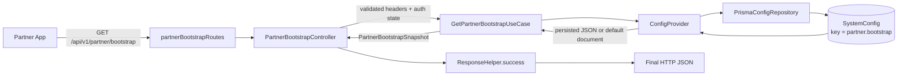
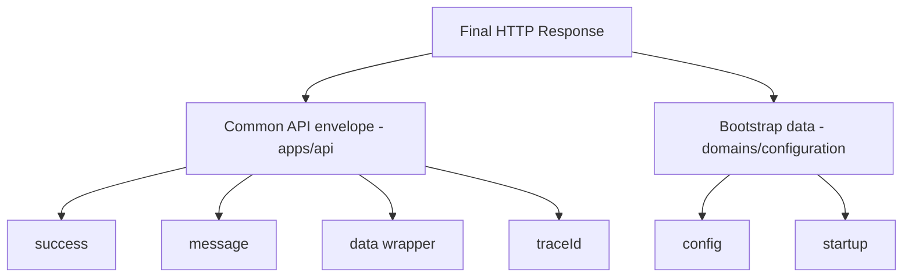
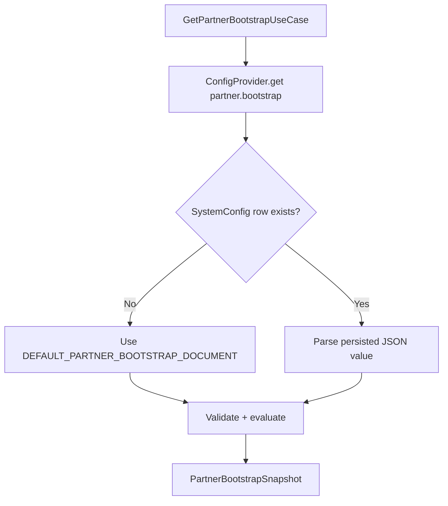
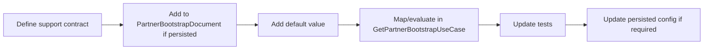
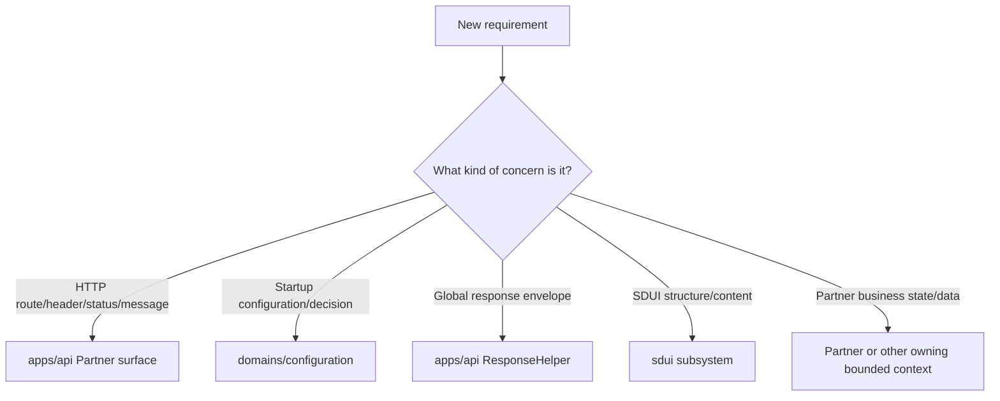

# Configuration Domain (`domains/configuration/`)

> **Architecture authority:** `docs/MASTER-BACKEND-CONSTITUTION.md` §19  
> **Package:** `@carbroz/domain-configuration`

Configuration owns persisted business/runtime product configuration such as maintenance mode, supported app versions, update policy, feature rollout, bootstrap decisions, and startup routing.

It does **not** own environment variables, secrets, ports, database URLs, provider credentials, logging configuration, Partner KYC, bookings, jobs, payouts, profile data, or SDUI structure. Those remain with their owning API/platform/domain/SDUI boundaries.

---

## 1. Quick mental model

For Partner startup, Configuration answers only the small set of questions needed before the next screen is loaded:

- Is the app under maintenance?
- Is an app update required or optional?
- Which Partner startup features are enabled?
- Is this request authenticated?
- Which SDUI screen should load next?

Current endpoint:

```http
GET /api/v1/partner/bootstrap
```

Persisted configuration key:

```text
partner.bootstrap
```

### Complete request-to-response flow



### Response ownership



**Fast rule:**

- Change something **inside `data`** → normally change the Configuration contract/use case.
- Change route, HTTP method, headers, message, status, or common response envelope → change the Partner API transport layer that owns that concern.
- Change SDUI structure → change the SDUI subsystem, not Configuration.
- Change Partner business state/data → change the owning Partner/Booking/Operations/etc. context, not bootstrap configuration.

---

## 2. Current Partner bootstrap contract

### Request

```http
GET /api/v1/partner/bootstrap
X-CarBroz-Platform: ANDROID
X-CarBroz-App-Version: 1.0.0
X-CarBroz-Build-Number: 1
Authorization: Bearer <token>   # optional
```

### Unauthenticated response

```json
{
  "success": true,
  "message": "Partner bootstrap completed",
  "data": {
    "config": {
      "version": "1",
      "maintenance": {
        "enabled": false,
        "title": null,
        "message": null
      },
      "update": {
        "required": false,
        "optional": false,
        "minimumVersion": "1.0.0",
        "latestVersion": "1.0.0",
        "storeUrl": null
      },
      "features": {
        "registrationEnabled": true,
        "individualPartnerEnabled": true,
        "organizationPartnerEnabled": true
      }
    },
    "startup": {
      "authenticated": false,
      "nextScreen": {
        "screenId": "partner_login",
        "templateId": "partner_login_template",
        "templateType": "form_template",
        "endpoint": "/api/v1/partner/sdui/registry/partner_login",
        "method": "GET",
        "authentication": "NONE"
      }
    }
  },
  "traceId": "req-x"
}
```

Authenticated startup currently selects the configured Partner dashboard destination instead of the guest login destination.

---

## 3. Exact files and classes

| Responsibility | Class / symbol | Exact file |
| --- | --- | --- |
| Route registration | `partnerBootstrapRoutes` | `apps/api/src/surfaces/partner/routes/partner.bootstrap.routes.ts` |
| HTTP controller | `PartnerBootstrapController` | `apps/api/src/surfaces/partner/controllers/partner.bootstrap.controller.ts` |
| Request/header validation | `partnerBootstrapHeadersSchema` | `apps/api/src/surfaces/partner/dto/partner.bootstrap.dto.ts` |
| Request/result/config contracts | `PartnerBootstrapRequest`, `PartnerBootstrapDocument`, `PartnerBootstrapSnapshot` | `domains/configuration/application/contracts/partner-bootstrap.ts` |
| Bootstrap evaluation + response data creation | `GetPartnerBootstrapUseCase` | `domains/configuration/application/use-cases/GetPartnerBootstrapUseCase.ts` |
| Default persisted document | `DEFAULT_PARTNER_BOOTSTRAP_DOCUMENT` | `domains/configuration/application/use-cases/GetPartnerBootstrapUseCase.ts` |
| Config loading/fallback | `ConfigProvider` | `domains/configuration/application/ConfigProvider.ts` |
| Config repository | `PrismaConfigRepository` | `domains/configuration/infrastructure/repositories/PrismaConfigRepository.ts` |
| DI registration | `registerConfigModule` | `domains/configuration/config.module.ts` |
| Common API envelope | `ResponseHelper` | `apps/api/src/transport/response/ResponseHelper.ts` |
| Focused bootstrap tests | `GetPartnerBootstrapUseCase.spec.ts` | `domains/configuration/tests/GetPartnerBootstrapUseCase.spec.ts` |

### Which files should I open first?

For almost every Partner bootstrap response change, start here:

```text
1. domains/configuration/application/contracts/partner-bootstrap.ts
2. domains/configuration/application/use-cases/GetPartnerBootstrapUseCase.ts
3. apps/api/src/surfaces/partner/controllers/partner.bootstrap.controller.ts
```

Then use the change matrix below to decide whether anything else must change.

---

## 4. How configuration values are resolved

`GetPartnerBootstrapUseCase` asks `ConfigProvider` for:

```text
partner.bootstrap
```

Resolution behavior:



### Important persistence rule

`ConfigProvider` does **not** deep-merge persisted JSON with the latest default document.

Example: if production already stores:

```json
{
  "version": "1",
  "maintenance": {},
  "features": {}
}
```

and code later adds a required `support` section to the default document, the existing database record does not automatically receive that new field.

Therefore, when adding/renaming/removing required persisted fields, also decide how existing `partner.bootstrap` documents remain compatible. Prefer explicit versioning, migration, or normalization over silent assumptions.

---

## 5. Change guide — what to edit for any kind of change

| I want to change... | Primary files |
| --- | --- |
| Add a field inside `data.config` or `data.startup` | `partner-bootstrap.ts` + `GetPartnerBootstrapUseCase.ts` + tests |
| Rename a field inside `data` | Contract + use case + persisted config if applicable + tests + frontend compatibility |
| Delete a field inside `data` | Contract + use case + persisted config + tests + frontend compatibility |
| Move/restructure response fields | Contract + use case + tests; treat as client contract change |
| Change maintenance/update/features values only | persisted `partner.bootstrap` or default document |
| Change guest/authenticated next screen | persisted `partner.bootstrap` or default document |
| Change route `/bootstrap` | `partner.bootstrap.routes.ts` + client/API tests |
| Change HTTP method `GET` | route + client contract + request handling/tests |
| Add/rename/delete a request header | `partner.bootstrap.dto.ts`; then `PartnerBootstrapRequest` + controller/use case if consumed |
| Change `Partner bootstrap completed` | `PartnerBootstrapController` |
| Change HTTP status code | `PartnerBootstrapController` |
| Change global `data` wrapper, `success`, `traceId`, etc. | `ResponseHelper` — global API change, not Partner-only |
| Change database lookup mechanics | `ConfigProvider` / `PrismaConfigRepository` only if persistence behavior itself changes |
| Change SDUI screen structure/content | `sdui/*`, not Configuration |
| Add Partner KYC/profile/job/earnings data | owning Partner/Booking/Operations/Financials context, not bootstrap config |

---

## 6. Examples

### A. Add a new response field

Requirement:

```json
"config": {
  "support": {
    "phone": "1800...",
    "email": "support@carbroz.com"
  }
}
```

Correct flow:



Steps:

1. In `application/contracts/partner-bootstrap.ts`, add the new type/field.
2. If it is configurable, add it to `PartnerBootstrapDocument`.
3. Add a safe default to `DEFAULT_PARTNER_BOOTSTRAP_DOCUMENT`.
4. Add it to the `PartnerBootstrapSnapshot` result shape.
5. Map it in `GetPartnerBootstrapUseCase.execute()`.
6. Update `GetPartnerBootstrapUseCase.spec.ts`.
7. If a `partner.bootstrap` DB row exists, update/version/normalize that persisted JSON as required.

Do **not** add the field directly in `PartnerBootstrapController` just to make JSON look correct. The controller is an HTTP adapter, not the owner of Configuration policy.

### B. Rename a response field

Example:

```text
registrationEnabled
        ↓
partnerRegistrationEnabled
```

Consider all of these together:

```text
Contract
  ↓
Default/persisted configuration
  ↓
Use-case mapping
  ↓
Tests
  ↓
Frontend compatibility/versioning
```

A rename is a contract change. Do not rename only the returned object while leaving persisted configuration and client expectations inconsistent.

### C. Delete a field

Before deleting:

1. Confirm the frontend no longer consumes it.
2. Remove it from the transport-neutral contract.
3. Remove its default/persisted config ownership if applicable.
4. Remove its use-case mapping.
5. Update tests.
6. Consider backward compatibility if older app versions still call this endpoint.

### D. Change the endpoint path

Current:

```http
GET /api/v1/partner/bootstrap
```

Route owner:

```text
apps/api/src/surfaces/partner/routes/partner.bootstrap.routes.ts
```

For example, changing `/bootstrap` to `/startup` is an API contract change. Update:

```text
route registration
→ API tests / Bruno collection if maintained
→ frontend endpoint
→ documentation
```

Do not change Configuration use-case logic merely because the HTTP URL changes.

### E. Add a request header

Example:

```http
X-CarBroz-Locale: en-IN
```

If only transport validation is needed, change:

```text
apps/api/src/surfaces/partner/dto/partner.bootstrap.dto.ts
```

If the use case needs the value:

```text
partnerBootstrapHeadersSchema
        ↓
PartnerBootstrapController
        ↓
PartnerBootstrapRequest
        ↓
GetPartnerBootstrapUseCase
```

The Configuration use case must receive transport-neutral input; it must not read Fastify headers directly.

### F. Change only the success message

Current:

```json
"message": "Partner bootstrap completed"
```

Change only:

```text
PartnerBootstrapController
```

because the controller supplies that message to `ResponseHelper.success(...)`.

### G. Change `data` to `payload`

That is **not** a Partner bootstrap-only change.

Current common envelope:

```json
{
  "success": true,
  "message": "...",
  "data": {},
  "traceId": "..."
}
```

The common envelope is owned by:

```text
apps/api/src/transport/response/ResponseHelper.ts
```

Changing `data` → `payload` can affect Partner, Customer, Admin, Booking and every other API using `ResponseHelper`; treat it as a global versioned API change.

### H. Change startup destination

Example guest destination:

```json
{
  "screenId": "partner_login",
  "templateId": "partner_login_template",
  "templateType": "form_template",
  "endpoint": "/api/v1/partner/sdui/registry/partner_login",
  "method": "GET",
  "authentication": "NONE"
}
```

This destination is Configuration-owned startup routing data. Change the persisted `partner.bootstrap` document when runtime management is desired, or the default document when changing the built-in fallback.

The **actual SDUI definition** for that screen still belongs to the SDUI subsystem.

---

## 7. Current implementation notes

### `X-CarBroz-Build-Number`

The header is currently validated by `partnerBootstrapHeadersSchema`, but `PartnerBootstrapController` does not yet pass it into `GetPartnerBootstrapUseCase`.

If build-number-based update policy is needed later:

```text
DTO validation
   ↓
PartnerBootstrapController
   ↓
PartnerBootstrapRequest.buildNumber
   ↓
GetPartnerBootstrapUseCase evaluation
```

Do not read request headers from inside the Configuration domain.

### Authenticated startup

Bootstrap currently selects either:

```text
guest → partner_login
```

or:

```text
authenticated → partner_dashboard
```

Full Partner lifecycle routing such as incomplete registration, KYC review, training, suspension, or other Partner states should be designed with the owning Partner lifecycle rules before adding them to bootstrap. Configuration may carry startup routing configuration, but it must not absorb Partner business-state ownership.

---

## 8. Architecture boundary checklist

Before adding a bootstrap field, ask:



Guardrails:

- Partner, Customer and Admin contracts remain independently evolvable.
- HTTP/Fastify concerns remain in `apps/api`.
- Persisted startup/business-runtime configuration remains in `domains/configuration`.
- SDUI structure remains under `sdui/`.
- KYC, jobs, earnings, bookings, availability, profile and similar business data do not become generic bootstrap configuration.
- Do not change `ResponseHelper` for a Partner-only response change.
- Reuse existing Configuration contracts/providers before introducing new abstractions.
- When a persisted contract changes, consider existing DB documents and older app versions explicitly.

---

## 9. Core Configuration implementation

```text
domains/configuration/
├── application/
│   ├── contracts/
│   │   └── partner-bootstrap.ts
│   ├── use-cases/
│   │   └── GetPartnerBootstrapUseCase.ts
│   ├── ConfigProvider.ts
│   └── IConfigProvider.ts
├── domain/
├── infrastructure/
│   └── repositories/
│       └── PrismaConfigRepository.ts
├── tests/
│   ├── ConfigProvider.spec.ts
│   ├── FeatureFlagProvider.spec.ts
│   └── GetPartnerBootstrapUseCase.spec.ts
├── config.module.ts
└── README.md
```

---

## 10. Verification after changes

### Partner bootstrap behavior

```powershell
pnpm exec vitest run domains/configuration/tests/GetPartnerBootstrapUseCase.spec.ts
```

### Configuration package build

```powershell
pnpm --filter @carbroz/domain-configuration build
```

### API/DI regression when transport/composition changes

```powershell
pnpm exec vitest run apps/api/src/bootstrap/container/index.test.ts
pnpm --filter @carbroz/api build
```

### Runtime readiness

```powershell
Invoke-RestMethod http://127.0.0.1:3000/health/readiness |
    ConvertTo-Json -Depth 10
```

### Partner bootstrap runtime check

```powershell
$headers = @{
    "X-CarBroz-Platform" = "ANDROID"
    "X-CarBroz-App-Version" = "1.0.0"
    "X-CarBroz-Build-Number" = "1"
}

Invoke-RestMethod `
    -Uri "http://127.0.0.1:3000/api/v1/partner/bootstrap" `
    -Headers $headers `
    -Method GET |
    ConvertTo-Json -Depth 10
```

### Final repository verification

```powershell
pnpm test:freeze
```

---

## 11. Safe-change sequence

For any future Partner bootstrap change, use this order:

```text
1. Read this README + MASTER-BACKEND-CONSTITUTION.md
2. Identify the owner of the requested change
3. Inspect the existing contract/use case/transport code
4. Decide compatibility impact
5. Update contract first when data shape changes
6. Update default/persisted configuration when applicable
7. Update use-case evaluation/mapping
8. Update transport only for HTTP concerns
9. Update focused tests
10. Build + run runtime bootstrap check
11. Run final freeze verification
```

This keeps `GET /api/v1/partner/bootstrap` small, explicit, versionable, and maintainable instead of letting it become a generic Partner data endpoint.
